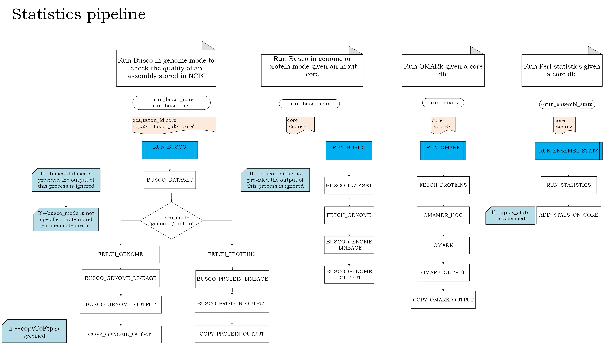

# Genebuild statistics pipeline

The pipeline provides Busco, Omark completeness scores, calculates statistics for Ensembl website when the core database is available. 
If only the assembly accession and the taxon id are available the pipeline provide Busco score (mode=genome) for the assembly.



## Running options  

The following options require a list of mandatory arguments (see `Mandatory arguments`).

## Busco pipeline `--run_busco_core`

Busco is a measure of completeness of genome assembly and annotation of the gene set. See the documentation for further details [Busco userguide](https://busco.ezlab.org/busco_userguide.html)

Docker image available in https://hub.docker.com/r/ezlabgva/busco

#### `--busco_mode`
Select Busco mode, i.e. genome mode (assess a genome assembly), protein mode (assess a gene set) or both. By default, run both modes.

#### `--busco_dataset`
Select Busco dataset; if not specified the pipeline will choose  the closest lineage according to the ncbi taxonomy classification.

#### `--copyToFtp`
Boolean option to copy output in Ensembl ftp, default false

#### `--apply_busco_metakeys`
Boolean option to load Busco metakey into db

#### `--host`
The host name for the databases 

#### `--port`
The port number of the host 

#### `--user`
The read/wrote username for the host. 

#### `--user_r`
The read only username for the host. 

#### `--password`
The database password. 

```bash
nextflow -C $ENSCODE/ensembl-genes-nf/nextflow.config run $ENSCODE/ensembl-genes-nf/pipelines/nextflow/workflows/statistics.nf -entry STATISTICS --bioperl <bioperl_lib> --enscode $ENSCODE --csvFile <csv_file_path> --outDir <output_dir_path> --host <mysql_host> --port <mysql_port> --user <user> --user_r <read_user>  --password <mysql_password> --mode <busco_mode> --run_busco_core true -profile slurm
```

## OMArk pipeline `--run_omark`
  
OMArk is a software of proteome (protein-coding gene repertoire) quality assessment. It provides measure of proteome completeness, characterize all protein coding genes in the light of existing homologs, and identify the presence of contamination from other species.
Further information available in the official repo https://github.com/DessimozLab/OMArk

#### `--copyToFtp`
Boolean option to copy output in Ensembl ftp, default false

#### `--host`
The host name for the databases 

#### `--port`
The port number of the host 

#### `--user`
The read/wrote username for the host. 

#### `--user_r`
The read only username for the host. 

#### `--password`
The database password. 

```bash
nextflow -C $ENSCODE/ensembl-genes-nf/nextflow.config run $ENSCODE/ensembl-genes-nf/pipelines/nextflow/workflows/statistics.nf -entry STATISTICS --bioperl <bioperl_lib> --enscode $ENSCODE --csvFile <csv_file_path> --outDir <output_dir_path> --host <mysql_host> --port <mysql_port> --user <user> --user_r <read_user>  --password <mysql_password> --run_omark true -profile slurm
```

## Ensembl statistics pipeline `--run_ensembl_stats`

The pipeline calculate core statistics for Ensembl browser.

### `--apply_stats`
Boolean option to upload Ensembl statistics in a mysql db, default false

#### `--copyToFtp`
Boolean option to copy output in Ensembl ftp, default false

#### `--host`
The host name for the databases 

#### `--port`
The port number of the host 

#### `--user`
The read/wrote username for the host. 

#### `--user_r`
The read only username for the host. 

#### `--password`
The database password. 

```bash
nextflow -C $ENSCODE/ensembl-genes-nf/nextflow.config run $ENSCODE/ensembl-genes-nf/pipelines/nextflow/workflows/statistics.nf -entry STATISTICS --bioperl <bioperl_lib> --enscode $ENSCODE --csvFile <csv_file_path> --outDir <output_dir_path> --host <mysql_host> --port <mysql_port> --user <user> --user_r <read_user>  --password <mysql_password>  --run_ensembl_stats true -profile slurm
```

## Busco NCBI genome pipeline `--run_busco_ncbi`

Option available to check the quality of the genome by running Busco in genome mode.

```bash
nextflow -C $ENSCODE/ensembl-genes-nf/nextflow.config run $ENSCODE/ensembl-genes-nf/pipelines/nextflow/workflows/statistics.nf -entry STATISTICS --bioperl <bioperl_lib> --enscode $ENSCODE --csvFile <csv_file_path> --outDir <output_dir_path>  --run_busco_ncbi true -profile slurm
```


## Requirements

### Mandatory arguments

#### `--csvFile`
The structure of the file can cahnge according to the running options
| Running mode | csv file format |
|-----------------|--------|
| --run_busco_core |  core (header)   | 
|                  |  <db_name>  |
| --run_omark |  core  (header)  | 
|                  |  <db_name>  |
| --run_busco_ncbi |  gca,taxon_id (header)   | 
|                  |  <gca>,<taxon_id>  |

#### `--enscode`
Path to the root directory containing the Perl repositories (ensembl-analysis)

#### `--outDir`
Path to the directory where to store the results of the pipeline

### Optional arguments

#### `--bioperl`
Path to the directory containing the BioPerl 1.6.924 library. If not provided, the value passed to `--enscode` will be used as root, i.e. `<enscode>/bioperl-1.6.924`.

#### `--cacheDir`
Path to the directory to use as cache for the intermediate files. If not provided, the value passed to `--outDir` will be used as root, i.e. `<outDir>/cache`.

#### `--files_latency`
Sleep time (in seconds) after the genome and proteins have been fetched. Needed by several file systems due to their internal latency. By default, 60 seconds.

### Pipeline configuration

#### Using the provided nextflow.config
We are using profiles to be able to run the pipeline on different HPC clusters. The default is `standard`.

* `standard`: uses LSF to run the compute heavy jobs. It expects the usage of `scratch` to use a low latency filesystem.
* `slurm`: uses SLURM to run the compute heavy jobs. It expects the usage of `scratch` to use a low latency filesystem.


#### Using a local configuration file
You can use a local config with `-c` to finely configure your pipeline. All parameters can be configured, we recommend setting these ones as well:

* `process.scratch`: The patch to the scratch directory to use
* `workDir`: The directory where nextflow stores any file

### Information about all the parameters

```bash
nextflow run ./ensembl-genes-nf/pipelines/nextflow/workflows/statistics.nf --help
```


#### Ensembl dependencies
These are the Ensembl repositories required by this pipeline:

| Repository name | branch | URL|
|-----------------|--------|----|
| ensembl | default | https://github.com/Ensembl/ensembl.git |
| ensembl-analysis | main | https://github.com/Ensembl/ensembl-analysis.git |
| ensembl-io | default | https://github.com/Ensembl/ensembl-io.git |
|core_meta_updates | default | https://github.com/Ensembl/core_meta_updates.git |

It is recommended that all the repositories are cloned into the same folder.

Remember that, following the instructions in [Ensembl's Perl API installation](http://www.ensembl.org/info/docs/api/api_installation.html), you will also need to have BioPerl v1.6.924 available in your system. If you do not, you can install it executing the following commands:

```bash
wget https://github.com/bioperl/bioperl-live/archive/release-1-6-924.zip
unzip release-1-6-924.zip
mv bioperl-live-release-1-6-924 bioperl-1.6.924
```

It is recommended to install it in the same folder as the Ensembl repositories.
