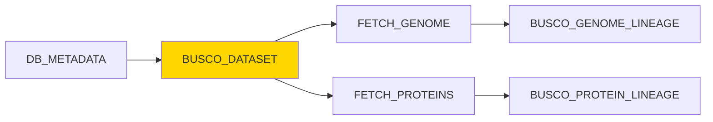

# BUSCO_DATASET Module

## Overview

The `BUSCO_DATASET` module selects the most appropriate BUSCO lineage dataset for a given species based on its taxonomic classification. It uses the NCBI taxonomy ID to traverse the phylogenetic tree and identify the closest available BUSCO ortholog database (ODB), ensuring optimal quality assessment for genome or protein completeness.

**Module Location**: `pipelines/statistics/modules/busco_dataset.nf`

## Functionality

This module performs critical dataset selection:

1. **Automatic Selection**: Uses `clade_selector.py` to find the best BUSCO lineage based on taxonomy
2. **Manual Override**: Accepts pre-specified datasets via metadata
3. **Phylogenetic Matching**: Traverses NCBI taxonomy tree to find closest available ODB
4. **Dataset Validation**: Ensures selected dataset exists in the BUSCO datasets file

The module acts as a decision point, determining which BUSCO lineage dataset (e.g., `vertebrata_odb10`, `bacteria_odb10`, `metazoa_odb10`) should be used for downstream BUSCO analysis.

## Inputs

### Channel Input

```groovy
val meta
```

**Metadata Map**:
```groovy
[
    gca: String,                     // Genome assembly accession
    taxon_id: String,                // REQUIRED: NCBI taxonomy ID (e.g., "9606")
    dbname: String,                  // Database name
    species_id: Integer,             // Species ID
    production_species: String,      // Production name
    busco_dataset: String            // Optional: Pre-specified BUSCO dataset
]
```

### Parameters

| Parameter | Type | Default | Description |
|-----------|------|---------|-------------|
| `params.busco_datasets_file` | String | Required | Path to BUSCO datasets configuration file |

## Outputs

### Channel Outputs

| Channel | Type | Description |
|---------|------|-------------|
| `busco_dataset_output` | `tuple val(meta), stdout` | Metadata + selected dataset name |
| `versions_file` | `path("versions.yml")` | Software versions used |

### Output Values

#### BUSCO Dataset Name (stdout)

**Format**: Plain text string (single line)

**Example Values**:
```
vertebrata_odb10
bacteria_odb10
metazoa_odb10
fungi_odb10
embryophyta_odb10
```

**Common Lineages**:

| Lineage | Taxonomy Coverage | Typical Use |
|---------|-------------------|-------------|
| `eukaryota_odb10` | All eukaryotes | Distant eukaryotes |
| `metazoa_odb10` | All animals | Animals without closer lineage |
| `vertebrata_odb10` | Vertebrates | Mammals, birds, fish, reptiles |
| `mammalia_odb10` | Mammals | Mammalian genomes |
| `primates_odb10` | Primates | Human, apes, monkeys |
| `bacteria_odb10` | All bacteria | Bacterial genomes |
| `fungi_odb10` | Fungi | Yeast, molds |
| `embryophyta_odb10` | Land plants | Plant genomes |
| `arthropoda_odb10` | Arthropods | Insects, crustaceans |

#### Versions File

**Location**: Working directory (not published)

**Format**: YAML

**Content Example**:
```yaml
"BUSCO_DATASET":
  python: 3.11.0
  clade_selector: 1.0.0
```

## Process Configuration

### Directives

```groovy
label 'python'               // Use Python resource allocation
tag "${meta.gca}"            // Tag with GCA accession
```

### Resource Allocation

From `nextflow.config` (`python` label):

- **CPUs**: 2
- **Memory**: 4 GB
- **Time**: 2 hours
- **Queue**: Standard

### Container

```
ensemblorg/ensembl-genes-metadata:latest
```

**Installed Tools**:
- Python 3.11
- `clade_selector.py` - Custom BUSCO dataset selection script
- NCBI taxonomy tools

## Implementation Details

### Selection Logic

The module uses conditional logic to determine dataset source:

```bash
if [[ !"${meta.busco_dataset}" ]]; then
    # No dataset specified - use clade_selector
    clade_selector.py -d ${params.busco_datasets_file} -t ${meta.taxon_id}
else 
    # Dataset already specified - use it
    echo "${meta.busco_dataset}"
fi
```

### Clade Selector Algorithm

The `clade_selector.py` script:

1. **Reads Taxonomy**: Retrieves full taxonomic lineage for the given taxon_id
2. **Traverses Tree**: Walks up the taxonomic tree (species → genus → family → order → class → phylum)
3. **Matches Dataset**: Finds the most specific BUSCO lineage available
4. **Returns Best Match**: Outputs the closest ODB dataset name

**Example Traversal** (Human - taxon_id: 9606):
```
9606 (Homo sapiens)
  ↓
9605 (Homo)
  ↓
9604 (Homininae)
  ↓
9443 (Primates) ← Match! primates_odb10 available
  ↓
40674 (Mammalia) ← Backup: mammalia_odb10
  ↓
7742 (Vertebrata) ← Fallback: vertebrata_odb10
```

**Best Match**: `primates_odb10` (most specific available)

### BUSCO Datasets File

The `params.busco_datasets_file` contains mappings between taxonomy IDs and BUSCO lineages:

**Format**: Tab-separated values (TSV)

**Example Content**:
```tsv
# Taxonomy_ID	Lineage_Name	BUSCO_Dataset
9443	Primates	primates_odb10
40674	Mammalia	mammalia_odb10
7742	Vertebrata	vertebrata_odb10
7711	Chordata	metazoa_odb10
33208	Metazoa	metazoa_odb10
2759	Eukaryota	eukaryota_odb10
2	Bacteria	bacteria_odb10
2157	Archaea	archaea_odb10
```

**File Location**: Typically in the pipeline configuration directory or shared reference data

### Debug Output

The module logs debug information to stderr:

```bash
echo "DEBUG: meta.core=${meta.dbname}, meta.species_id=${meta.species_id}, meta.taxon_id=${meta.taxon_id}" >&2
```

This helps troubleshoot dataset selection issues.

## Usage Example

### In a Workflow

```groovy
include { BUSCO_DATASET } from '../modules/busco_dataset.nf'

workflow {
    // Create input channel
    def input_ch = channel.of([
        gca: 'GCA_000001405.29',
        taxon_id: '9606',           // Human
        dbname: 'homo_sapiens_core_110_38',
        species_id: 1,
        production_species: 'homo_sapiens',
        busco_dataset: ''           // Auto-select
    ])
    
    // Select BUSCO dataset
    def dataset_ch = BUSCO_DATASET(input_ch).busco_dataset_output
    
    // Process results
    dataset_ch.view { meta, dataset ->
        "Selected dataset for ${meta.production_species}: ${dataset.trim()}"
    }
}
```

### With Pre-specified Dataset

```groovy
workflow {
    // Use specific dataset (skip auto-selection)
    def input_ch = channel.of([
        gca: 'GCA_000001405.29',
        taxon_id: '9606',
        dbname: 'homo_sapiens_core_110_38',
        species_id: 1,
        production_species: 'homo_sapiens',
        busco_dataset: 'vertebrata_odb10'  // Use this instead
    ])
    
    BUSCO_DATASET(input_ch)
}
```

### Expected Output

**Console Output**:
```
DEBUG: meta.core=homo_sapiens_core_110_38, meta.species_id=1, meta.taxon_id=9606
Selected dataset for homo_sapiens: primates_odb10
```

**Stdout Capture**: `primates_odb10`

### Downstream Usage

The selected dataset is added to metadata:

```groovy
BUSCO_DATASET(metadata).busco_dataset_output
    .map { tuple_meta, stdout_file ->
        def new_meta = tuple_meta + [
            busco_dataset: tuple_meta.busco_dataset ? 
                tuple_meta.busco_dataset.trim() : 
                stdout_file.trim()
        ]
        return new_meta
    }
```

Result:
```groovy
[
    gca: 'GCA_000001405.29',
    taxon_id: '9606',
    dbname: 'homo_sapiens_core_110_38',
    species_id: 1,
    production_species: 'homo_sapiens',
    busco_dataset: 'primates_odb10'  // ← Added
]
```

## Error Handling

### Common Errors

#### 1. Missing Taxonomy ID

**Error Message**:
```
ERROR ~ Error executing process > 'BUSCO_DATASET (GCA_000001405.29)'
Caused by: taxon_id is required for dataset selection
```

**Solution**:
- Ensure `DB_METADATA` ran successfully
- Verify taxonomy ID was extracted from database
- Check metadata propagation in workflow

#### 2. Invalid Taxonomy ID

**Error Message**:
```
ERROR: Taxonomy ID '999999999' not found in NCBI taxonomy database
```

**Solution**:
- Verify taxonomy ID at [NCBI Taxonomy](https://www.ncbi.nlm.nih.gov/taxonomy)
- Check for merged or invalid taxonomy IDs
- Use current taxonomy ID from NCBI

#### 3. No Matching Dataset

**Error Message**:
```
WARNING: No BUSCO dataset found for taxon_id=9606
Using fallback: eukaryota_odb10
```

**Cause**: No specific lineage available in BUSCO datasets file

**Solution**:
- This is expected behavior - uses most general applicable dataset
- Update `busco_datasets_file` with newer BUSCO releases
- Manually specify appropriate dataset if known

#### 4. Missing Datasets File

**Error Message**:
```
FileNotFoundError: [Errno 2] No such file or directory: '/path/to/busco_datasets.tsv'
```

**Solution**:
```bash
# Check file exists
ls -l ${params.busco_datasets_file}

# Create or update path in nextflow.config
params.busco_datasets_file = '/path/to/correct/busco_datasets.tsv'
```

#### 5. Malformed Datasets File

**Error Message**:
```
ERROR: Failed to parse BUSCO datasets file
```

**Solution**:
- Verify TSV format (tab-separated)
- Check for header row
- Ensure consistent column count
- Validate taxonomy IDs are numeric

## Version Tracking

The module captures software versions:

```yaml
"BUSCO_DATASET":
  python: 3.11.0
  clade_selector: 1.0.0
```

**Captured Versions**:
- Python interpreter version
- `clade_selector.py` script version

## Integration with Other Modules

### Upstream Modules

1. **DB_METADATA**: Provides `taxon_id` for dataset selection

### Downstream Modules

1. **BUSCO_GENOME_LINEAGE**: Uses selected dataset for genome assessment
2. **BUSCO_PROTEIN_LINEAGE**: Uses selected dataset for protein assessment

### Data Flow Diagram



## Dataset Selection Examples

### Example 1: Human (Homo sapiens)

**Input**:
- Taxon ID: `9606`

**Selection Process**:
1. Check `9606` (Homo sapiens) - No direct match
2. Check `9605` (Homo) - No match
3. Check `9443` (Primates) - **MATCH!**

**Output**: `primates_odb10`

### Example 2: E. coli (Escherichia coli)

**Input**:
- Taxon ID: `511145`

**Selection Process**:
1. Check `511145` (E. coli str. K-12) - No direct match
2. Check `562` (Escherichia coli) - No match
3. Check `561` (Escherichia) - No match
4. Check `2` (Bacteria) - **MATCH!**

**Output**: `bacteria_odb10`

### Example 3: Fruit Fly (Drosophila melanogaster)

**Input**:
- Taxon ID: `7227`

**Selection Process**:
1. Check `7227` (Drosophila melanogaster) - No direct match
2. Check `7215` (Drosophila) - No match
3. Check `50557` (Insecta) - **MATCH!**

**Output**: `insecta_odb10`

### Example 4: Arabidopsis (Arabidopsis thaliana)

**Input**:
- Taxon ID: `3702`

**Selection Process**:
1. Check `3702` (Arabidopsis thaliana) - No direct match
2. Check `3701` (Arabidopsis) - No match
3. Check `3193` (Embryophyta) - **MATCH!**

**Output**: `embryophyta_odb10`

## Best Practices

### 1. Always Use Auto-Selection

**Recommended**:
```groovy
meta = [
    taxon_id: '9606',
    busco_dataset: ''  // Let clade_selector choose
]
```

**Avoid** (unless necessary):
```groovy
meta = [
    taxon_id: '9606',
    busco_dataset: 'vertebrata_odb10'  // Too general for primates
]
```

### 2. Verify Dataset Selection

Log selected datasets for verification:

```groovy
BUSCO_DATASET(input_ch).busco_dataset_output
    .subscribe { meta, dataset ->
        log.info "Taxon ${meta.taxon_id} (${meta.production_species}): ${dataset.trim()}"
    }
```

### 3. Update Datasets File Regularly

Keep `busco_datasets_file` current with latest BUSCO releases:

```bash
# Check for new BUSCO lineages
curl -s https://busco-data.ezlab.org/v5/data/lineages/ | grep "_odb10"

# Update datasets file with new lineages
```

### 4. Handle Missing Datasets Gracefully

Add fallback logic:

```groovy
BUSCO_DATASET(input_ch).busco_dataset_output
    .map { meta, dataset ->
        def selected = dataset.trim()
        if (selected == "eukaryota_odb10") {
            log.warn "Using general eukaryota dataset for ${meta.production_species}"
        }
        [meta + [busco_dataset: selected]]
    }
```

### 5. Cache Dataset Selections

For large-scale analyses, cache selections:

```groovy
process BUSCO_DATASET {
    // Add caching
    cache 'lenient'
    storeDir "${params.cacheDir}/busco_datasets"
    
    // ... rest of process
}
```

## Performance Considerations

### Execution Time

Typical execution time: **2-5 seconds** per species

**Factors affecting performance**:
- NCBI taxonomy database response time
- Size of BUSCO datasets file
- Network latency (if accessing remote taxonomy DB)

### Parallelization

Multiple dataset selections can run in parallel:

```groovy
// Select datasets for 100 species simultaneously
channel.fromPath('species_list.csv')
    .splitCsv(header: true)
    .map { row -> [taxon_id: row.taxon_id, /*...*/] }
    | BUSCO_DATASET  // Runs in parallel
```

**Recommended concurrency**: Unlimited (very lightweight process)

### Resource Usage

**Minimal resources required**:
- **CPU**: < 5% utilization
- **Memory**: < 50 MB
- **Disk**: Negligible
- **Network**: < 1 KB (if accessing remote taxonomy)

## Advanced Features

### Custom Dataset Mapping

Override default mappings:

```groovy
process BUSCO_DATASET {
    script:
    def custom_mapping = [
        '9606': 'primates_odb10',  // Human
        '10090': 'mammalia_odb10',  // Mouse
        '7227': 'diptera_odb10'     // Fly
    ]
    
    def dataset = custom_mapping[meta.taxon_id] ?: 
        "clade_selector.py -d ${params.busco_datasets_file} -t ${meta.taxon_id}"
    
    """
    echo "${dataset}"
    """
}
```

### Multiple Dataset Selection

Select primary and fallback datasets:

```groovy
script:
"""
# Get best match
PRIMARY=\$(clade_selector.py -d ${params.busco_datasets_file} -t ${meta.taxon_id})

# Get parent lineage as fallback
FALLBACK=\$(clade_selector.py -d ${params.busco_datasets_file} -t ${meta.taxon_id} --level parent)

echo "PRIMARY=\${PRIMARY}"
echo "FALLBACK=\${FALLBACK}"
"""
```

### Dataset Validation

Verify selected dataset exists:

```groovy
script:
"""
DATASET=\$(clade_selector.py -d ${params.busco_datasets_file} -t ${meta.taxon_id})

# Validate dataset exists in download path
if [ -d "${params.download_path}/lineages/\${DATASET}" ]; then
    echo "\${DATASET}"
else
    echo "ERROR: Dataset \${DATASET} not found in ${params.download_path}" >&2
    exit 1
fi
"""
```

## Testing

### Unit Test

Test dataset selection for known species:

```bash
# Test with human genome
nextflow run pipelines/statistics/main.nf \
    --run_busco_core \
    --csvFile test_data/test_busco_dataset.csv \
    --busco_datasets_file config/busco_datasets.tsv \
    --mysqlUrl "mysql://ensembldb.ensembl.org:3306/" \
    --mysqluser "anonymous" \
    -entry BUSCO \
    --max_cpus 2 \
    -process.executor 'local'
```

**test_busco_dataset.csv**:
```csv
dbname,species_id,busco_dataset,genome_file,protein_file
homo_sapiens_core_110_38,1,,,
```

### Expected Test Result

**Console Output**:
```
DEBUG: meta.core=homo_sapiens_core_110_38, meta.species_id=1, meta.taxon_id=9606
Selected dataset: primates_odb10
```

**Metadata Enrichment**:
```groovy
[
    dbname: 'homo_sapiens_core_110_38',
    species_id: 1,
    taxon_id: '9606',
    gca: 'GCA_000001405.29',
    production_species: 'homo_sapiens',
    busco_dataset: 'primates_odb10'
]
```

### Validation

Verify dataset selection is appropriate:

```bash
# Check taxonomy lineage
python -c "
from ete3 import NCBITaxa
ncbi = NCBITaxa()
lineage = ncbi.get_lineage(9606)
names = ncbi.get_taxid_translator(lineage)
print({taxid: names[taxid] for taxid in lineage})
"

# Expected output includes:
# 9443: 'Primates'  ← Should match primates_odb10
```

## Troubleshooting

### Debug Mode

Enable verbose clade selection:

```groovy
script:
"""
# Add verbose flag
clade_selector.py -d ${params.busco_datasets_file} -t ${meta.taxon_id} --verbose

# Show full taxonomy lineage
clade_selector.py -d ${params.busco_datasets_file} -t ${meta.taxon_id} --show-lineage
"""
```

### Check Dataset File

Verify datasets file is valid:

```bash
# View datasets file
cat ${params.busco_datasets_file}

# Count available lineages
grep -c "odb10" ${params.busco_datasets_file}

# Check for specific taxon
grep "9606\|9443\|40674\|7742" ${params.busco_datasets_file}
```

### Manual Dataset Selection

Test clade_selector.py directly:

```bash
# Test script manually
python /path/to/clade_selector.py \
    -d config/busco_datasets.tsv \
    -t 9606 \
    --verbose

# Expected output: primates_odb10
```

### Verify BUSCO Lineage Availability

Check which lineages are available:

```bash
# List available BUSCO lineages
ls ${params.download_path}/lineages/

# Check specific lineage
ls -la ${params.download_path}/lineages/primates_odb10/
```

## Related Documentation

- [DB_METADATA Module](db-metadata.md) - Provides taxonomy ID
- [BUSCO_GENOME_LINEAGE Module](busco-genome-lineage.md) - Uses selected dataset
- [BUSCO_PROTEIN_LINEAGE Module](busco-protein-lineage.md) - Uses selected dataset
- [BUSCO Workflow](../workflows/busco.md) - Complete workflow

## References

- [BUSCO User Guide](https://busco.ezlab.org/) - Official BUSCO documentation
- [BUSCO Lineages](https://busco-data.ezlab.org/v5/data/lineages/) - Available datasets
- [NCBI Taxonomy](https://www.ncbi.nlm.nih.gov/taxonomy) - Taxonomy database
- [OrthoDB](https://www.orthodb.org/) - Ortholog database source for BUSCO

---

**Last Updated**: 2026-02-06 23:55:41  
**Module Version**: 1.0.0  
**Maintained By**: Ensembl Genes Team
