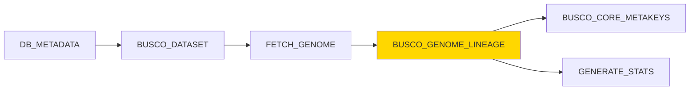

# BUSCO_GENOME_LINEAGE Module

## Overview

The `BUSCO_GENOME_LINEAGE` module assesses genome assembly completeness by running BUSCO (Benchmarking Universal Single-Copy Orthologs) analysis in **genome mode**. It quantifies genome quality by searching for expected single-copy orthologs from a specific lineage dataset, providing metrics on complete, fragmented, duplicated, and missing BUSCOs.

**Module Location**: `pipelines/statistics/modules/busco_genome_lineage.nf`

## Functionality

This module performs comprehensive genome quality assessment:

1. **Genome Completeness Analysis**: Searches genomic sequences for universal single-copy orthologs
2. **Gene Prediction**: Uses Augustus or Metaeuk to predict genes within the genome
3. **Ortholog Mapping**: Compares predictions against lineage-specific BUSCO datasets
4. **Quality Metrics**: Generates statistics on complete (C), complete single-copy (S), complete duplicated (D), fragmented (F), and missing (M) BUSCOs
5. **Offline Mode**: Uses pre-downloaded BUSCO datasets from `params.download_path`

The module provides standardized, quantitative quality metrics used to assess genome assembly and annotation completeness.

## Inputs

### Channel Input

```groovy
tuple val(meta), path(genome_file)
```

**Metadata Map**:
```groovy
[
    gca: String,                     // Genome assembly accession
    busco_dataset: String,           // REQUIRED: BUSCO lineage (e.g., "primates_odb10")
    dbname: String,                  // Database name
    species_id: Integer,             // Species ID
    production_species: String       // Production name
]
```

**Genome File**:
- **Format**: FASTA (`.fa`, `.fasta`, `.fna`)
- **Content**: Genomic DNA sequences (can be scaffolds, contigs, or chromosomes)
- **Compression**: Can be gzipped (`.gz`)
- **Size**: Typically 10 MB - 5 GB

### Parameters

| Parameter | Type | Default | Description |
|-----------|------|---------|-------------|
| `params.download_path` | String | Required | Path to pre-downloaded BUSCO lineage datasets |
| `params.outdir` | String | Required | Output directory for results |
| `params.files_latency` | Integer | `5` | File system latency wait time (seconds) |

## Outputs

### Published Outputs

**Directory**: `${params.outdir}/${meta.gca}/`

#### 1. Summary Files

| File | Description | Format |
|------|-------------|--------|
| `short_summary.specific.*.txt` | Main BUSCO summary with key metrics | Plain text |
| `busco_genome_batch_summary.txt` | Full batch summary (verbose) | Plain text |

#### 2. Versions File

| File | Description |
|------|-------------|
| `versions_busco_genome.yml` | Software versions used in analysis |

### Channel Outputs

| Channel | Type | Description |
|---------|------|-------------|
| `busco_genome_short_summary_output` | `tuple val(meta), path("short_summary.*.txt")` | Key summary file |
| `busco_genome_batch_summary_output` | `tuple val(meta), path("busco_genome_batch_summary.txt")` | Verbose batch summary |
| `versions_file` | `path("versions_busco_genome.yml")` | Versions tracking file |

### Output File Contents

#### short_summary.specific.{lineage}.{assembly}.txt

**Example**:
```
# BUSCO version is: 5.4.3 
# The lineage dataset is: primates_odb10 (Creation date: 2024-01-16, number of genomes: 40, number of BUSCOs: 13780)
# Summarized benchmarking in BUSCO notation for file GCA_000001405.29_GRCh38.p14_genomic.fna.gz
# BUSCO was run in mode: genome

	***** Results: *****

	C:98.8%[S:96.5%,D:2.3%],F:0.6%,M:0.6%,n:13780	   

	13608	Complete BUSCOs (C)			   
	13295	Complete and single-copy BUSCOs (S)	   
	313	Complete and duplicated BUSCOs (D)	   
	83	Fragmented BUSCOs (F)			   
	89	Missing BUSCOs (M)			   
	13780	Total BUSCO groups searched		   

# Dependencies and versions:
# 	hmmer: 3.3.2
# 	metaeuk: 6.a5d39d9
```

**Key Metrics Explained**:
- **C (Complete)**: BUSCOs found with expected length (> 95% of expected length)
- **S (Single-copy)**: Complete BUSCOs found exactly once
- **D (Duplicated)**: Complete BUSCOs found more than once
- **F (Fragmented)**: BUSCOs found but shorter than expected
- **M (Missing)**: BUSCOs not found at all

#### busco_genome_batch_summary.txt

**Example**:
```
# Summarized BUSCO benchmarking for GCA_000001405.29_GRCh38.p14_genomic.fna.gz
Input_file	Dataset	Complete	Single	Duplicated	Fragmented	Missing	n_markers	Scores-cutoff
GCA_000001405.29_GRCh38.p14_genomic.fna.gz	primates_odb10	98.8	96.5	2.3	0.6	0.6	13780	default
```

**Columns**:
1. **Input_file**: Genome file analyzed
2. **Dataset**: BUSCO lineage used
3. **Complete**: % complete BUSCOs (C)
4. **Single**: % single-copy BUSCOs (S)
5. **Duplicated**: % duplicated BUSCOs (D)
6. **Fragmented**: % fragmented BUSCOs (F)
7. **Missing**: % missing BUSCOs (M)
8. **n_markers**: Total BUSCO groups in dataset
9. **Scores-cutoff**: Detection threshold used

#### versions_busco_genome.yml

**Format**: YAML

**Content Example**:
```yaml
"BUSCO_GENOME_LINEAGE":
  busco: 5.4.3
  python: 3.11.0
  hmmer: 3.3.2
  metaeuk: 6.a5d39d9
  sepp: 4.5.1
  prodigal: 2.6.3
```

## Process Configuration

### Directives

```groovy
label 'busco'                                   // Use BUSCO resource allocation
tag "${meta.gca}"                               // Tag with GCA accession
publishDir "${params.outdir}/${meta.gca}"       // Publish to species-specific directory
afterScript "sleep ${params.files_latency}"     // Wait for file system sync
maxForks 10                                     // Limit concurrent executions
```

### Resource Allocation

From `nextflow.config` (`busco` label):

- **CPUs**: 8 cores
- **Memory**: 32 GB
- **Time**: 24 hours
- **Queue**: Standard

### Container

```
ezlabgva/busco:v5.4.3_cv1
```

**Installed Tools**:
- BUSCO 5.4.3
- HMMER 3.3.2
- Metaeuk 6.a5d39d9
- Augustus 3.5.0
- Prodigal 2.6.3
- SEPP 4.5.1
- Python 3.11

## Implementation Details

### BUSCO Command

The core BUSCO execution:

```bash
busco \
    -f \
    --offline \
    --in ${genome_file} \
    --out ${meta.gca}_busco_genome \
    --mode genome \
    --lineage_dataset ${meta.busco_dataset} \
    --download_path ${params.download_path} \
    --cpu ${task.cpus}
```

**Parameter Breakdown**:

| Flag | Purpose |
|------|---------|
| `-f` | Force overwrite of existing results |
| `--offline` | Use local datasets (no downloads) |
| `--in` | Input genome file |
| `--out` | Output directory name |
| `--mode genome` | **Genome analysis mode** (vs. proteins/transcriptome) |
| `--lineage_dataset` | BUSCO lineage to use (e.g., `primates_odb10`) |
| `--download_path` | Path to pre-downloaded lineages |
| `--cpu` | Number of CPU cores to use |

### Offline Mode

The module uses `--offline` to avoid downloading datasets during execution:

**Requirements**:
1. Datasets must be pre-downloaded to `params.download_path`
2. Directory structure must match BUSCO expectations:
   ```
   ${params.download_path}/
   ├── lineages/
   │   ├── primates_odb10/
   │   │   ├── ancestral
   │   │   ├── dataset.cfg
   │   │   ├── hmms/
   │   │   ├── prfl/
   │   │   └── scores_cutoff
   │   ├── vertebrata_odb10/
   │   └── bacteria_odb10/
   └── placement_files/
   ```

**Pre-downloading Datasets**:
```bash
# Download specific lineage
busco --download lineage primates_odb10 --download_path /path/to/busco_data

# Download all datasets
busco --list-datasets
busco --download all --download_path /path/to/busco_data
```

### Gene Prediction

BUSCO performs gene prediction using:

1. **Metaeuk** (default for eukaryotes):
   - Profile-based gene prediction
   - Better sensitivity for divergent sequences
   - Used for eukaryotic lineages

2. **Prodigal** (for prokaryotes):
   - Fast ab initio gene prediction
   - Used for bacterial/archaeal lineages

3. **Augustus** (optional):
   - Can be specified with `--augustus` flag
   - Species-specific training available

### Output Organization

BUSCO creates a nested output structure:

```
${meta.gca}_busco_genome/
├── short_summary.specific.primates_odb10.${meta.gca}_busco_genome.txt  ← Published
├── full_table.tsv  ← Detailed per-BUSCO results (not published)
├── missing_busco_list.tsv  ← List of missing BUSCOs (not published)
├── single_copy_busco_sequences/  ← Individual gene sequences (not published)
├── busco_sequences/
│   ├── fragmented_busco_sequences/
│   └── multi_copy_busco_sequences/
└── run_primates_odb10/  ← Internal BUSCO files (not published)
```

**Published**: Only summary files are published to save space

### Post-processing

The module collects and renames summary files:

```bash
# Move short summary
find ./${meta.gca}_busco_genome/ -name "short_summary.*.txt" \
    -exec mv {} . \;

# Copy batch summary
cp ./${meta.gca}_busco_genome/batch_summary.txt \
    busco_genome_batch_summary.txt
```

## Usage Example

### In a Workflow

```groovy
include { BUSCO_DATASET } from '../modules/busco_dataset.nf'
include { FETCH_GENOME } from '../modules/fetch_genome.nf'
include { BUSCO_GENOME_LINEAGE } from '../modules/busco_genome_lineage.nf'

workflow {
    // Get metadata and select dataset
    def meta_ch = channel.of([
        gca: 'GCA_000001405.29',
        dbname: 'homo_sapiens_core_110_38',
        species_id: 1,
        production_species: 'homo_sapiens',
        taxon_id: '9606'
    ])
    
    // Select appropriate BUSCO dataset
    def dataset_ch = BUSCO_DATASET(meta_ch).busco_dataset_output
        .map { meta, stdout ->
            meta + [busco_dataset: stdout.text.trim()]
        }
    
    // Fetch genome file
    def genome_ch = FETCH_GENOME(dataset_ch).genome_file_output
    
    // Run BUSCO analysis
    BUSCO_GENOME_LINEAGE(genome_ch)
    
    // View results
    BUSCO_GENOME_LINEAGE.out.busco_genome_short_summary_output
        .view { meta, summary ->
            "BUSCO genome analysis for ${meta.gca}: ${summary}"
        }
}
```

### Configuration

**nextflow.config**:
```groovy
params {
    // BUSCO configuration
    download_path = '/data/busco_datasets'
    outdir = '/output/busco_results'
    files_latency = 5
    
    // Resource allocation
    max_cpus = 8
    max_memory = '32.GB'
    max_time = '24.h'
}

process {
    withLabel: busco {
        cpus = 8
        memory = 32.GB
        time = 24.h
    }
}
```

### Expected Output Files

**Published to**: `${params.outdir}/GCA_000001405.29/`

1. **short_summary.specific.primates_odb10.GCA_000001405.29_busco_genome.txt**
2. **busco_genome_batch_summary.txt**
3. **versions_busco_genome.yml**

## Quality Interpretation

### High-Quality Genome Assembly

**Metrics**:
- **Complete (C)**: ≥ 95%
- **Single-copy (S)**: ≥ 90%
- **Duplicated (D)**: < 5%
- **Fragmented (F)**: < 3%
- **Missing (M)**: < 2%

**Example** (Human GRCh38):
```
C:98.8%[S:96.5%,D:2.3%],F:0.6%,M:0.6%,n:13780
```

**Interpretation**:
- ✅ Excellent completeness (98.8%)
- ✅ High single-copy rate (96.5%)
- ✅ Low duplication (2.3% - expected for mammals)
- ✅ Minimal fragmentation (0.6%)
- ✅ Very few missing BUSCOs (0.6%)

**Assessment**: **High-quality assembly suitable for annotation and analysis**

### Good-Quality Genome Assembly

**Metrics**:
- **Complete (C)**: 85-95%
- **Single-copy (S)**: 80-90%
- **Duplicated (D)**: 5-15%
- **Fragmented (F)**: 3-10%
- **Missing (M)**: 2-10%

**Example**:
```
C:90.5%[S:84.2%,D:6.3%],F:5.2%,M:4.3%,n:10000
```

**Interpretation**:
- ✅ Good completeness (90.5%)
- ⚠️ Moderate single-copy rate (84.2%)
- ⚠️ Some duplication (6.3%)
- ⚠️ Moderate fragmentation (5.2%)
- ⚠️ Some missing BUSCOs (4.3%)

**Assessment**: **Usable assembly, may need polishing or gap filling**

### Poor-Quality Genome Assembly

**Metrics**:
- **Complete (C)**: < 85%
- **Single-copy (S)**: < 80%
- **Fragmented (F)**: > 10%
- **Missing (M)**: > 10%

**Example**:
```
C:72.8%[S:68.1%,D:4.7%],F:12.5%,M:14.7%,n:10000
```

**Interpretation**:
- ❌ Low completeness (72.8%)
- ❌ Poor single-copy rate (68.1%)
- ❌ High fragmentation (12.5%)
- ❌ Many missing BUSCOs (14.7%)

**Assessment**: **Poor assembly quality - significant contamination, fragmentation, or incomplete sequencing**

**Recommendations**:
1. Re-sequence with higher coverage
2. Use better assembly algorithms
3. Perform contamination screening
4. Increase sequencing read length

### Duplication Patterns

**Normal Duplication** (D: 2-5%):
- Reflects recent whole-genome duplications
- Common in vertebrates, plants
- Expected biological feature

**High Duplication** (D: > 10%):
- May indicate:
  - Recent whole-genome duplication (polyploidy)
  - Haplotypic duplication (phased assembly issue)
  - Contamination
  - Misassembly

**Very High Duplication** (D: > 20%):
- Likely assembly issues:
  - Failed haplotype separation
  - Multiple individuals sequenced
  - Severe contamination

## Error Handling

### Common Errors

#### 1. Missing Lineage Dataset

**Error Message**:
```
ERROR: Unable to find lineage 'primates_odb10' in /path/to/busco_data
```

**Cause**: Lineage not downloaded or incorrect path

**Solution**:
```bash
# Download missing lineage
busco --download lineage primates_odb10 --download_path ${params.download_path}

# Or verify path
ls ${params.download_path}/lineages/primates_odb10/
```

#### 2. Insufficient Memory

**Error Message**:
```
ERROR: Process 'BUSCO_GENOME_LINEAGE' terminated with an error exit status (137) -- Execution is retried (1)
```

**Cause**: Out of memory (exit code 137)

**Solution** (in `nextflow.config`):
```groovy
process {
    withLabel: busco {
        memory = 64.GB  // Increase from 32.GB
    }
}
```

#### 3. Corrupt Genome File

**Error Message**:
```
ERROR: FASTA parser error: Unexpected character in header
```

**Solution**:
- Validate FASTA format:
  ```bash
  # Check for non-standard characters
  grep ">" genome.fa | head
  
  # Validate with SeqKit
  seqkit stats genome.fa
  ```
- Fix headers if needed:
  ```bash
  sed 's/[^a-zA-Z0-9_>.-]/_/g' genome.fa > genome_clean.fa
  ```

#### 4. Empty Output Files

**Error Message**:
```
ERROR: Process requirement not met - No summary files produced
```

**Cause**: BUSCO failed silently

**Solution**:
- Check BUSCO logs:
  ```bash
  cat ${meta.gca}_busco_genome/logs/busco.log
  ```
- Verify input file:
  ```bash
  head genome.fa
  wc -l genome.fa
  ```
- Test BUSCO manually:
  ```bash
  busco -i genome.fa -o test_run -m genome -l primates_odb10 --offline
  ```

#### 5. CPU Resource Contention

**Error Message**:
```
WARNING: BUSCO analysis slower than expected
```

**Cause**: Too many concurrent BUSCO processes

**Solution** (adjust maxForks):
```groovy
process {
    withName: BUSCO_GENOME_LINEAGE {
        maxForks = 5  // Reduce from 10
    }
}
```

#### 6. File System Latency Issues

**Symptom**: Missing output files immediately after process completion

**Solution**:
- Increase `params.files_latency`:
  ```groovy
  params.files_latency = 10  // Increase from 5
  ```
- Use `stageOutMode`:
  ```groovy
  process {
      stageOutMode = 'copy'  // Force immediate copy
  }
  ```

## Version Tracking

The module captures comprehensive version information:

```yaml
"BUSCO_GENOME_LINEAGE":
  busco: 5.4.3
  python: 3.11.0
  hmmer: 3.3.2
  metaeuk: 6.a5d39d9
  sepp: 4.5.1
  prodigal: 2.6.3
```

**Version Extraction**:
```bash
# BUSCO version
busco --version | sed 's/BUSCO //'

# Python version
python --version | awk '{print $2}'

# HMMER version
hmmsearch -h | grep "# HMMER" | sed 's/# HMMER //' | awk '{print $1}'
```

## Integration with Other Modules

### Upstream Modules

1. **BUSCO_DATASET**: Provides `busco_dataset` for lineage selection
2. **FETCH_GENOME**: Provides genome file for analysis
3. **DB_METADATA**: Provides species metadata

### Downstream Modules

1. **BUSCO_CORE_METAKEYS**: Stores BUSCO metrics in database
2. **GENERATE_STATS**: Aggregates quality metrics

### Data Flow Diagram



## Performance Considerations

### Execution Time

Typical execution times:

| Genome Size | CPU Cores | Time |
|-------------|-----------|------|
| 100 MB (bacterial) | 8 | 10-30 min |
| 500 MB (fungal) | 8 | 30 min - 2 hours |
| 1 GB (insect) | 8 | 1-3 hours |
| 3 GB (human) | 8 | 4-12 hours |
| 10 GB (plant) | 8 | 12-24 hours |

**Factors affecting performance**:
- Genome size and complexity
- Number of BUSCOs in lineage dataset
- CPU cores allocated
- Gene prediction method (Metaeuk vs. Augustus)
- Disk I/O speed

### Resource Optimization

#### For Small Genomes (< 500 MB)

```groovy
process {
    withName: BUSCO_GENOME_LINEAGE {
        cpus = 4
        memory = 16.GB
        time = 4.h
    }
}
```

#### For Large Genomes (> 5 GB)

```groovy
process {
    withName: BUSCO_GENOME_LINEAGE {
        cpus = 16
        memory = 64.GB
        time = 48.h
    }
}
```

### Parallelization Strategy

The `maxForks 10` directive limits concurrent BUSCO analyses to prevent resource exhaustion:

**Example**: Analyzing 100 genomes
- **Without maxForks**: All 100 start simultaneously → cluster overload
- **With maxForks 10**: Only 10 run concurrently → optimal resource usage

**Tuning maxForks**:
```groovy
// Conservative (resource-limited clusters)
maxForks 5

// Moderate (balanced)
maxForks 10

// Aggressive (large clusters)
maxForks 20
```

### Disk Space Requirements

**Per-genome space usage**:
- **Input genome**: 0.1-5 GB
- **BUSCO output**: 0.5-10 GB (depending on genome size)
- **Published summaries**: < 1 MB

**Recommendation**: Ensure `workDir` has 50-100 GB per concurrent BUSCO process

## Advanced Features

### Custom BUSCO Parameters

Add custom BUSCO flags:

```groovy
process BUSCO_GENOME_LINEAGE {
    script:
    """
    busco \
        -f \
        --offline \
        --in ${genome_file} \
        --out ${meta.gca}_busco_genome \
        --mode genome \
        --lineage_dataset ${meta.busco_dataset} \
        --download_path ${params.download_path} \
        --cpu ${task.cpus} \
        --augustus \
        --augustus_species ${meta.augustus_species} \
        --long \
        --limit 3
    """
}
```

**Additional Flags**:
- `--augustus`: Use Augustus instead of Metaeuk
- `--augustus_species`: Species for Augustus training
- `--long`: Optimize for long read assemblies
- `--limit`: Max number of regions per BUSCO

### Multiple Lineage Analysis

Run BUSCO with multiple lineages:

```groovy
workflow {
    def meta_ch = channel.of([
        gca: 'GCA_000001405.29',
        busco_datasets: ['primates_odb10', 'mammalia_odb10', 'vertebrata_odb10']
    ])
    
    def genome_ch = FETCH_GENOME(meta_ch)
    
    // Explode to multiple lineages
    genome_ch.flatMap { meta, genome ->
        meta.busco_datasets.collect { dataset ->
            [meta + [busco_dataset: dataset], genome]
        }
    }
    | BUSCO_GENOME_LINEAGE
}
```

### Comparative Analysis

Compare results across lineages:

```groovy
BUSCO_GENOME_LINEAGE.out.busco_genome_batch_summary_output
    .collectFile(name: 'combined_busco_results.txt', 
                 keepHeader: true,
                 storeDir: "${params.outdir}/")
```

Result: Single file with all BUSCO results for comparison

## Testing

### Unit Test

Test BUSCO analysis on small genome:

```bash
# Test with E. coli genome
nextflow run pipelines/statistics/main.nf \
    --run_busco_core \
    --csvFile test_data/test_busco_genome.csv \
    --download_path /data/busco_datasets \
    --outdir test_results \
    --mysqlUrl "mysql://ensembldb.ensembl.org:3306/" \
    --mysqluser "anonymous" \
    -entry BUSCO \
    --max_cpus 8 \
    -process.executor 'local'
```

**test_busco_genome.csv**:
```csv
dbname,species_id,busco_dataset,genome_file,protein_file
escherichia_coli_core_110_1,1,bacteria_odb10,test_data/ecoli.fa,
```

### Expected Test Output

**Console Log**:
```
[BUSCO_GENOME_LINEAGE] Running BUSCO for GCA_000005845.2
[BUSCO] 2024-02-06 12:00:00 INFO: Starting BUSCO in genome mode
[BUSCO] 2024-02-06 12:15:23 INFO: Results written to GCA_000005845.2_busco_genome
[BUSCO] 2024-02-06 12:15:24 INFO: BUSCO analysis complete
```

**Output Files**:
```
test_results/GCA_000005845.2/
├── short_summary.specific.bacteria_odb10.GCA_000005845.2_busco_genome.txt
├── busco_genome_batch_summary.txt
└── versions_busco_genome.yml
```

**Expected Metrics** (E. coli):
```
C:98.5%[S:98.3%,D:0.2%],F:0.8%,M:0.7%,n:124
```

### Validation

Compare results with expected ranges:

```bash
# Extract completeness percentage
COMPLETE=$(grep "C:" short_summary.*.txt | sed 's/.*C:\([0-9.]*\)%.*/\1/')

# Validate
if (( $(echo "$COMPLETE >= 95" | bc -l) )); then
    echo "✅ PASS: Completeness ${COMPLETE}% (expected >= 95%)"
else
    echo "❌ FAIL: Completeness ${COMPLETE}% (expected >= 95%)"
fi
```

## Best Practices

### 1. Use Appropriate Lineages

**Best Practice**: Always use the most specific lineage available

```groovy
// GOOD - specific lineage
meta.busco_dataset = "primates_odb10"  // For human

// AVOID - too general
meta.busco_dataset = "eukaryota_odb10"  // For human (too broad)
```

### 2. Pre-download All Datasets

**Setup**:
```bash
# Download all required lineages before running pipeline
busco --list-datasets
busco --download all --download_path /data/busco_datasets
```

### 3. Monitor Resource Usage

**Track memory and CPU**:
```groovy
process {
    withLabel: busco {
        cpus = 8
        memory = { 32.GB * task.attempt }  // Double on retry
        time = { 24.h * task.attempt }
        maxRetries = 2
        errorStrategy = 'retry'
    }
}
```

### 4. Handle Failed Analyses

```groovy
process {
    withName: BUSCO_GENOME_LINEAGE {
        errorStrategy = { task.exitStatus in [137, 140] ? 'retry' : 'ignore' }
        maxRetries = 2
    }
}
```

**Exit codes**:
- **137**: Out of memory
- **140**: Timeout
- **Other**: Skip and continue

### 5. Aggregate Results

Collect all BUSCO results for downstream analysis:

```groovy
workflow {
    BUSCO_GENOME_LINEAGE(genome_ch)
    
    // Collect all summaries
    BUSCO_GENOME_LINEAGE.out.busco_genome_short_summary_output
        .collectFile(name: 'all_busco_genomes.txt', 
                     storeDir: "${params.outdir}/summary/")
}
```

## Troubleshooting

### Debug Mode

Enable verbose BUSCO logging:

```bash
export BUSCO_CONFIG_FILE=/path/to/config.ini

# config.ini
[busco]
log_level = DEBUG
```

### Check BUSCO Logs

Inspect detailed logs:

```bash
# View main log
cat ${meta.gca}_busco_genome/logs/busco.log

# Check HMMER logs
cat ${meta.gca}_busco_genome/logs/hmmsearch_*.log

# Check Metaeuk logs
cat ${meta.gca}_busco_genome/logs/metaeuk_*.log
```

### Manual Execution

Test BUSCO manually:

```bash
# Run BUSCO directly
busco \
    -i genome.fa \
    -o test_busco \
    -m genome \
    -l primates_odb10 \
    --offline \
    --download_path /data/busco_datasets \
    --cpu 8 \
    -f

# Check results
cat test_busco/short_summary.*.txt
```

### Compare with nf-core/busco

Validate results against nf-core implementation:

```bash
nextflow run nf-core/busco \
    --input genome.fa \
    --mode genome \
    --lineage primates_odb10 \
    --busco_lineages_path /data/busco_datasets \
    --outdir compare_results
```

## Related Documentation

- [BUSCO_DATASET Module](busco-dataset.md) - Dataset selection
- [BUSCO_PROTEIN_LINEAGE Module](busco-protein-lineage.md) - Protein-based analysis
- [FETCH_GENOME Module](fetch-genome.md) - Genome file retrieval
- [BUSCO Workflow](../workflows/busco.md) - Complete workflow

## References

- [BUSCO Official Documentation](https://busco.ezlab.org/)
- [BUSCO User Guide](https://busco.ezlab.org/busco_userguide.html)
- [BUSCO Publication](https://academic.oup.com/mbe/article/38/10/4647/6329644) - Manni et al. 2021
- [Metaeuk Paper](https://microbiomejournal.biomedcentral.com/articles/10.1186/s40168-020-00808-x)
- [nf-core/busco Pipeline](https://github.com/nf-core/busco)

---

**Last Updated**: 2026-02-06 23:58:12  
**Module Version**: 1.0.0  
**Maintained By**: Ensembl Genes Team
