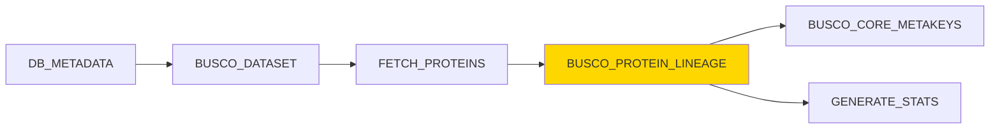

# BUSCO_PROTEIN_LINEAGE Module

## Overview

The `BUSCO_PROTEIN_LINEAGE` module assesses annotation completeness by running BUSCO (Benchmarking Universal Single-Copy Orthologs) analysis in **proteins mode**. It evaluates the quality of genome annotations by directly searching protein sequences for expected single-copy orthologs, providing metrics on complete, fragmented, duplicated, and missing BUSCOs.

**Module Location**: `pipelines/statistics/modules/busco_protein_lineage.nf`

## Functionality

This module performs comprehensive annotation quality assessment:

1. **Annotation Completeness Analysis**: Searches translated protein sequences for universal single-copy orthologs
2. **Direct Protein Comparison**: Uses HMMER profile searches (no gene prediction required)
3. **Ortholog Detection**: Compares proteins against lineage-specific BUSCO datasets
4. **Quality Metrics**: Generates statistics on complete (C), complete single-copy (S), complete duplicated (D), fragmented (F), and missing (M) BUSCOs
5. **Offline Mode**: Uses pre-downloaded BUSCO datasets from `params.download_path`

The module provides standardized, quantitative quality metrics used to assess genome annotation completeness and gene prediction accuracy.

## Key Differences from BUSCO_GENOME_LINEAGE

| Aspect | BUSCO_GENOME_LINEAGE | BUSCO_PROTEIN_LINEAGE |
|--------|---------------------|----------------------|
| **Input** | Genomic DNA sequences | Protein sequences (translations) |
| **Mode** | `genome` | `proteins` |
| **Gene Prediction** | Required (Metaeuk/Augustus) | Not required (uses existing translations) |
| **Speed** | Slower (includes gene prediction) | Faster (direct protein search) |
| **Purpose** | Assembly quality assessment | Annotation quality assessment |
| **Use Case** | Evaluate genome completeness | Evaluate annotation completeness |

**When to use**:
- **BUSCO_GENOME_LINEAGE**: Assessing raw genome assemblies before annotation
- **BUSCO_PROTEIN_LINEAGE**: Assessing quality of annotated protein-coding genes

## Inputs

### Channel Input

```groovy
tuple val(meta), path(protein_file)
```

**Metadata Map**:
```groovy
[
    gca: String,                     // Genome assembly accession
    busco_dataset: String,           // REQUIRED: BUSCO lineage (e.g., "primates_odb10")
    dbname: String,                  // Database name
    species_id: Integer,             // Species ID
    production_species: String       // Production name
]
```

**Protein File**:
- **Format**: FASTA (`.fa`, `.fasta`, `.faa`)
- **Content**: Translated protein sequences (amino acids)
- **Source**: Typically from `FETCH_PROTEINS` module
- **Compression**: Can be gzipped (`.gz`)
- **Size**: Typically 5-50 MB
- **Headers**: Must include unique protein IDs

### Parameters

| Parameter | Type | Default | Description |
|-----------|------|---------|-------------|
| `params.download_path` | String | Required | Path to pre-downloaded BUSCO lineage datasets |
| `params.outdir` | String | Required | Output directory for results |
| `params.files_latency` | Integer | `5` | File system latency wait time (seconds) |

## Outputs

### Published Outputs

**Directory**: `${params.outdir}/${meta.gca}/`

#### 1. Summary Files

| File | Description | Format |
|------|-------------|--------|
| `short_summary.specific.*.txt` | Main BUSCO summary with key metrics | Plain text |
| `busco_protein_batch_summary.txt` | Full batch summary (verbose) | Plain text |

#### 2. Versions File

| File | Description |
|------|-------------|
| `versions_busco_protein.yml` | Software versions used in analysis |

### Channel Outputs

| Channel | Type | Description |
|---------|------|-------------|
| `busco_protein_short_summary_output` | `tuple val(meta), path("short_summary.*.txt")` | Key summary file |
| `busco_protein_batch_summary_output` | `tuple val(meta), path("busco_protein_batch_summary.txt")` | Verbose batch summary |
| `versions_file` | `path("versions_busco_protein.yml")` | Versions tracking file |

### Output File Contents

#### short_summary.specific.{lineage}.{assembly}.txt

**Example**:
```
# BUSCO version is: 5.4.3 
# The lineage dataset is: primates_odb10 (Creation date: 2024-01-16, number of genomes: 40, number of BUSCOs: 13780)
# Summarized benchmarking in BUSCO notation for file translations.fa
# BUSCO was run in mode: proteins

	***** Results: *****

	C:97.2%[S:95.8%,D:1.4%],F:1.3%,M:1.5%,n:13780	   

	13394	Complete BUSCOs (C)			   
	13201	Complete and single-copy BUSCOs (S)	   
	193	Complete and duplicated BUSCOs (D)	   
	179	Fragmented BUSCOs (F)			   
	207	Missing BUSCOs (M)			   
	13780	Total BUSCO groups searched		   

# Dependencies and versions:
# 	hmmer: 3.3.2
```

**Key Metrics Explained**:
- **C (Complete)**: BUSCOs found with expected length (> 95% of expected length)
- **S (Single-copy)**: Complete BUSCOs found exactly once
- **D (Duplicated)**: Complete BUSCOs found more than once
- **F (Fragmented)**: BUSCOs found but shorter than expected
- **M (Missing)**: BUSCOs not found at all

**Interpretation vs. Genome Mode**:
- **Higher M (Missing)**: Indicates genes not annotated (missed in gene prediction)
- **Lower D (Duplicated)**: Genes typically single-copy; high duplication suggests annotation errors
- **Higher F (Fragmented)**: Indicates incomplete gene models or split genes

#### busco_protein_batch_summary.txt

**Example**:
```
# Summarized BUSCO benchmarking for translations.fa
Input_file	Dataset	Complete	Single	Duplicated	Fragmented	Missing	n_markers	Scores-cutoff
translations.fa	primates_odb10	97.2	95.8	1.4	1.3	1.5	13780	default
```

**Columns**:
1. **Input_file**: Protein file analyzed
2. **Dataset**: BUSCO lineage used
3. **Complete**: % complete BUSCOs (C)
4. **Single**: % single-copy BUSCOs (S)
5. **Duplicated**: % duplicated BUSCOs (D)
6. **Fragmented**: % fragmented BUSCOs (F)
7. **Missing**: % missing BUSCOs (M)
8. **n_markers**: Total BUSCO groups in dataset
9. **Scores-cutoff**: Detection threshold used

#### versions_busco_protein.yml

**Format**: YAML

**Content Example**:
```yaml
"BUSCO_PROTEIN_LINEAGE":
  busco: 5.4.3
  python: 3.11.0
  hmmer: 3.3.2
```

## Process Configuration

### Directives

```groovy
label 'busco'                                   // Use BUSCO resource allocation
tag "${meta.gca}"                               // Tag with GCA accession
publishDir "${params.outdir}/${meta.gca}"       // Publish to species-specific directory
afterScript "sleep ${params.files_latency}"     // Wait for file system sync
maxForks 10                                     // Limit concurrent executions
```

### Resource Allocation

From `nextflow.config` (`busco` label):

- **CPUs**: 8 cores
- **Memory**: 32 GB
- **Time**: 24 hours
- **Queue**: Standard

### Container

```
ezlabgva/busco:v5.4.3_cv1
```

**Installed Tools**:
- BUSCO 5.4.3
- HMMER 3.3.2
- Python 3.11

**Note**: Proteins mode does **NOT** require:
- Metaeuk (no gene prediction)
- Augustus (no gene prediction)
- Prodigal (no gene prediction)
- SEPP (no placement)

## Implementation Details

### BUSCO Command

The core BUSCO execution:

```bash
busco \
    -f \
    --offline \
    --in ${protein_file} \
    --out ${meta.gca}_busco_protein \
    --mode proteins \
    --lineage_dataset ${meta.busco_dataset} \
    --download_path ${params.download_path} \
    --cpu ${task.cpus}
```

**Parameter Breakdown**:

| Flag | Purpose |
|------|---------|
| `-f` | Force overwrite of existing results |
| `--offline` | Use local datasets (no downloads) |
| `--in` | Input protein file |
| `--out` | Output directory name |
| `--mode proteins` | **Proteins analysis mode** (vs. genome/transcriptome) |
| `--lineage_dataset` | BUSCO lineage to use (e.g., `primates_odb10`) |
| `--download_path` | Path to pre-downloaded lineages |
| `--cpu` | Number of CPU cores to use |

### Offline Mode

The module uses `--offline` to avoid downloading datasets during execution:

**Requirements**:
1. Datasets must be pre-downloaded to `params.download_path`
2. Directory structure must match BUSCO expectations:
   ```
   ${params.download_path}/
   ├── lineages/
   │   ├── primates_odb10/
   │   │   ├── ancestral
   │   │   ├── dataset.cfg
   │   │   ├── hmms/           ← Required for protein searches
   │   │   ├── prfl/
   │   │   └── scores_cutoff
   │   ├── vertebrata_odb10/
   │   └── bacteria_odb10/
   ```

**Pre-downloading Datasets**:
```bash
# Download specific lineage
busco --download lineage primates_odb10 --download_path /path/to/busco_data

# Download all datasets
busco --list-datasets
busco --download all --download_path /path/to/busco_data
```

### Protein Search Method

BUSCO proteins mode uses **HMMER** for ortholog detection:

1. **Profile HMM Search**:
   - Uses pre-built HMM profiles from lineage datasets
   - Searches protein sequences against HMM profiles
   - No gene prediction required

2. **Scoring**:
   - E-value threshold from `scores_cutoff` file
   - Length coverage requirement (> 95% for complete)
   - Domain architecture validation

3. **Classification**:
   - **Complete**: Length ≥ 95% of expected + passes score threshold
   - **Fragmented**: Passes score threshold but length < 95%
   - **Duplicated**: Multiple hits passing thresholds
   - **Missing**: No hits passing thresholds

### Output Organization

BUSCO creates a nested output structure:

```
${meta.gca}_busco_protein/
├── short_summary.specific.primates_odb10.${meta.gca}_busco_protein.txt  ← Published
├── full_table.tsv  ← Detailed per-BUSCO results (not published)
├── missing_busco_list.tsv  ← List of missing BUSCOs (not published)
├── hmmer_output/  ← HMMER search results (not published)
│   └── initial_run_results/
└── run_primates_odb10/  ← Internal BUSCO files (not published)
```

**Published**: Only summary files are published to save space

### Post-processing

The module collects and renames summary files:

```bash
# Move short summary
find ./${meta.gca}_busco_protein/ -name "short_summary.*.txt" \
    -exec mv {} . \;

# Copy batch summary
cp ./${meta.gca}_busco_protein/batch_summary.txt \
    busco_protein_batch_summary.txt
```

## Usage Example

### In a Workflow

```groovy
include { BUSCO_DATASET } from '../modules/busco_dataset.nf'
include { FETCH_PROTEINS } from '../modules/fetch_proteins.nf'
include { BUSCO_PROTEIN_LINEAGE } from '../modules/busco_protein_lineage.nf'

workflow {
    // Get metadata and select dataset
    def meta_ch = channel.of([
        gca: 'GCA_000001405.29',
        dbname: 'homo_sapiens_core_110_38',
        species_id: 1,
        production_species: 'homo_sapiens',
        taxon_id: '9606'
    ])
    
    // Select appropriate BUSCO dataset
    def dataset_ch = BUSCO_DATASET(meta_ch).busco_dataset_output
        .map { meta, stdout ->
            meta + [busco_dataset: stdout.text.trim()]
        }
    
    // Fetch protein translations
    def protein_ch = FETCH_PROTEINS(dataset_ch).protein_file_output
    
    // Run BUSCO analysis
    BUSCO_PROTEIN_LINEAGE(protein_ch)
    
    // View results
    BUSCO_PROTEIN_LINEAGE.out.busco_protein_short_summary_output
        .view { meta, summary ->
            "BUSCO protein analysis for ${meta.gca}: ${summary}"
        }
}
```

### Configuration

**nextflow.config**:
```groovy
params {
    // BUSCO configuration
    download_path = '/data/busco_datasets'
    outdir = '/output/busco_results'
    files_latency = 5
    
    // Resource allocation
    max_cpus = 8
    max_memory = '32.GB'
    max_time = '24.h'
}

process {
    withLabel: busco {
        cpus = 8
        memory = 32.GB
        time = 24.h
    }
}
```

### Expected Output Files

**Published to**: `${params.outdir}/GCA_000001405.29/`

1. **short_summary.specific.primates_odb10.GCA_000001405.29_busco_protein.txt**
2. **busco_protein_batch_summary.txt**
3. **versions_busco_protein.yml**

## Quality Interpretation

### High-Quality Annotation

**Metrics**:
- **Complete (C)**: ≥ 95%
- **Single-copy (S)**: ≥ 93%
- **Duplicated (D)**: < 2%
- **Fragmented (F)**: < 3%
- **Missing (M)**: < 2%

**Example** (Well-annotated human proteome):
```
C:97.2%[S:95.8%,D:1.4%],F:1.3%,M:1.5%,n:13780
```

**Interpretation**:
- ✅ Excellent annotation completeness (97.2%)
- ✅ High single-copy rate (95.8%)
- ✅ Low duplication (1.4% - normal for proteins)
- ✅ Minimal fragmentation (1.3%)
- ✅ Very few missing annotations (1.5%)

**Assessment**: **High-quality annotation with comprehensive gene models**

### Good-Quality Annotation

**Metrics**:
- **Complete (C)**: 85-95%
- **Single-copy (S)**: 82-93%
- **Duplicated (D)**: 2-5%
- **Fragmented (F)**: 3-8%
- **Missing (M)**: 2-10%

**Example**:
```
C:89.3%[S:85.7%,D:3.6%],F:5.1%,M:5.6%,n:10000
```

**Interpretation**:
- ✅ Good annotation completeness (89.3%)
- ⚠️ Moderate single-copy rate (85.7%)
- ⚠️ Some duplication (3.6% - possible annotation artifacts)
- ⚠️ Moderate fragmentation (5.1% - incomplete gene models)
- ⚠️ Some missing annotations (5.6%)

**Assessment**: **Usable annotation, may benefit from refinement**

### Poor-Quality Annotation

**Metrics**:
- **Complete (C)**: < 85%
- **Single-copy (S)**: < 82%
- **Fragmented (F)**: > 8%
- **Missing (M)**: > 10%

**Example**:
```
C:71.5%[S:67.2%,D:4.3%],F:11.8%,M:16.7%,n:10000
```

**Interpretation**:
- ❌ Low annotation completeness (71.5%)
- ❌ Poor single-copy rate (67.2%)
- ❌ High fragmentation (11.8% - many incomplete gene models)
- ❌ Many missing annotations (16.7%)

**Assessment**: **Poor annotation quality - significant gene prediction issues**

**Recommendations**:
1. Re-run gene prediction with better evidence
2. Incorporate RNA-seq data for training
3. Use homology-based gene prediction
4. Manual curation of critical genes
5. Check for UTR prediction issues

### Comparing Genome vs. Protein BUSCO Results

#### Scenario 1: Good Assembly, Poor Annotation

**Genome BUSCO**:
```
C:98.5%[S:96.8%,D:1.7%],F:0.8%,M:0.7%,n:13780
```

**Protein BUSCO**:
```
C:82.3%[S:78.5%,D:3.8%],F:9.2%,M:8.5%,n:13780
```

**Analysis**:
- ✅ Genome is excellent (98.5% complete)
- ❌ Annotations are poor (only 82.3% complete)
- **Problem**: Gene prediction failed to annotate many genes
- **Solution**: Improve gene prediction pipeline, add evidence (RNA-seq, homology)

#### Scenario 2: Poor Assembly, Misleading Protein Results

**Genome BUSCO**:
```
C:75.2%[S:71.3%,D:3.9%],F:12.1%,M:12.7%,n:13780
```

**Protein BUSCO**:
```
C:88.5%[S:85.2%,D:3.3%],F:6.3%,M:5.2%,n:13780
```

**Analysis**:
- ❌ Genome is poor (only 75.2% complete)
- ⚠️ Proteins look better (88.5% complete)
- **Problem**: Gene prediction annotated genes in fragmented/missing regions
- **Caveat**: Protein results may be misleading due to poor assembly
- **Solution**: Improve genome assembly first before trusting annotations

**Key Insight**: Always run **both** genome and protein BUSCO for complete quality assessment

## Error Handling

### Common Errors

#### 1. Missing Lineage Dataset

**Error Message**:
```
ERROR: Unable to find lineage 'primates_odb10' in /path/to/busco_data
```

**Cause**: Lineage not downloaded or incorrect path

**Solution**:
```bash
# Download missing lineage
busco --download lineage primates_odb10 --download_path ${params.download_path}

# Or verify path
ls ${params.download_path}/lineages/primates_odb10/
```

#### 2. Invalid Protein Sequences

**Error Message**:
```
ERROR: Invalid amino acid characters found in sequence
```

**Cause**: Non-protein characters in FASTA file

**Solution**:
```bash
# Check for invalid characters
grep -v "^>" translations.fa | grep -o . | sort -u

# Valid amino acids: ACDEFGHIKLMNPQRSTVWY*X
# Invalid: B, J, O, U, Z (except in special cases)

# Clean sequences
sed '/^>/!s/[^ACDEFGHIKLMNPQRSTVWY*X]//g' translations.fa > translations_clean.fa
```

#### 3. Empty Protein File

**Error Message**:
```
ERROR: No sequences found in input file
```

**Solution**:
- Verify file has content:
  ```bash
  wc -l translations.fa
  grep -c "^>" translations.fa
  ```
- Check FETCH_PROTEINS output:
  ```bash
  nextflow log -f "name,status,exit" | grep FETCH_PROTEINS
  ```

#### 4. Duplicate Protein IDs

**Error Message**:
```
WARNING: Duplicate sequence IDs found - results may be inaccurate
```

**Solution**:
```bash
# Find duplicates
grep "^>" translations.fa | sort | uniq -d

# Make IDs unique
awk '/^>/ {print $0"_"++count; next} {print}' translations.fa > translations_unique.fa
```

#### 5. Insufficient Memory

**Error Message**:
```
ERROR ~ Process 'BUSCO_PROTEIN_LINEAGE' terminated with an error exit status (137)
```

**Cause**: Out of memory (exit code 137)

**Solution** (in `nextflow.config`):
```groovy
process {
    withLabel: busco {
        memory = 64.GB  // Increase from 32.GB
    }
}
```

**Note**: Proteins mode uses less memory than genome mode, but large proteomes (>100k proteins) may still require significant RAM

#### 6. Missing HMMER Profiles

**Error Message**:
```
ERROR: HMMER profile files not found for lineage primates_odb10
```

**Cause**: Incomplete dataset download

**Solution**:
```bash
# Re-download lineage
rm -rf ${params.download_path}/lineages/primates_odb10
busco --download lineage primates_odb10 --download_path ${params.download_path}

# Verify HMMs exist
ls ${params.download_path}/lineages/primates_odb10/hmms/
```

## Version Tracking

The module captures version information:

```yaml
"BUSCO_PROTEIN_LINEAGE":
  busco: 5.4.3
  python: 3.11.0
  hmmer: 3.3.2
```

**Version Extraction**:
```bash
# BUSCO version
busco --version | sed 's/BUSCO //'

# Python version
python --version | awk '{print $2}'

# HMMER version
hmmsearch -h | grep "# HMMER" | sed 's/# HMMER //' | awk '{print $1}'
```

## Integration with Other Modules

### Upstream Modules

1. **BUSCO_DATASET**: Provides `busco_dataset` for lineage selection
2. **FETCH_PROTEINS**: Provides protein translations for analysis
3. **DB_METADATA**: Provides species metadata

### Downstream Modules

1. **BUSCO_CORE_METAKEYS**: Stores BUSCO metrics in database
2. **GENERATE_STATS**: Aggregates quality metrics

### Data Flow Diagram



## Performance Considerations

### Execution Time

Typical execution times:

| Proteome Size | CPU Cores | Time |
|---------------|-----------|------|
| 5,000 proteins (bacterial) | 8 | 5-15 min |
| 20,000 proteins (yeast) | 8 | 15-30 min |
| 25,000 proteins (fly) | 8 | 20-40 min |
| 40,000 proteins (human) | 8 | 30 min - 2 hours |
| 60,000 proteins (plant) | 8 | 1-3 hours |

**Factors affecting performance**:
- Number of proteins in input file
- Number of BUSCOs in lineage dataset
- CPU cores allocated
- Disk I/O speed

**Note**: Proteins mode is **much faster** than genome mode (no gene prediction overhead)

### Resource Optimization

#### For Small Proteomes (< 10k proteins)

```groovy
process {
    withName: BUSCO_PROTEIN_LINEAGE {
        cpus = 4
        memory = 8.GB
        time = 2.h
    }
}
```

#### For Large Proteomes (> 50k proteins)

```groovy
process {
    withName: BUSCO_PROTEIN_LINEAGE {
        cpus = 16
        memory = 64.GB
        time = 8.h
    }
}
```

### Parallelization Strategy

The `maxForks 10` directive limits concurrent BUSCO analyses to prevent resource exhaustion:

**Example**: Analyzing 100 species
- **Without maxForks**: All 100 start simultaneously → cluster overload
- **With maxForks 10**: Only 10 run concurrently → optimal resource usage

**Tuning maxForks**:
```groovy
// Conservative (resource-limited clusters)
maxForks 5

// Moderate (balanced)
maxForks 10

// Aggressive (large clusters with high throughput)
maxForks 20
```

**Proteins mode advantage**: Can support higher `maxForks` than genome mode due to lower resource requirements

### Disk Space Requirements

**Per-proteome space usage**:
- **Input proteins**: 5-50 MB
- **BUSCO output**: 100-500 MB (depending on proteome size)
- **Published summaries**: < 100 KB

**Recommendation**: Ensure `workDir` has 2-5 GB per concurrent BUSCO process

## Advanced Features

### Custom BUSCO Parameters

Add custom BUSCO flags:

```groovy
process BUSCO_PROTEIN_LINEAGE {
    script:
    """
    busco \
        -f \
        --offline \
        --in ${protein_file} \
        --out ${meta.gca}_busco_protein \
        --mode proteins \
        --lineage_dataset ${meta.busco_dataset} \
        --download_path ${params.download_path} \
        --cpu ${task.cpus} \
        --limit 3 \
        --tar
    """
}
```

**Additional Flags**:
- `--limit`: Max number of regions per BUSCO to analyze
- `--tar`: Create tarball of output directory
- `--evalue`: E-value threshold for HMMER searches (default: 1e-3)

### Multiple Lineage Analysis

Run BUSCO with multiple lineages:

```groovy
workflow {
    def meta_ch = channel.of([
        gca: 'GCA_000001405.29',
        busco_datasets: ['primates_odb10', 'mammalia_odb10', 'vertebrata_odb10']
    ])
    
    def protein_ch = FETCH_PROTEINS(meta_ch)
    
    // Explode to multiple lineages
    protein_ch.flatMap { meta, proteins ->
        meta.busco_datasets.collect { dataset ->
            [meta + [busco_dataset: dataset], proteins]
        }
    }
    | BUSCO_PROTEIN_LINEAGE
}
```

### Comparative Analysis

Compare genome vs. protein BUSCO results:

```groovy
workflow {
    // Run both modes
    BUSCO_GENOME_LINEAGE(genome_ch)
    BUSCO_PROTEIN_LINEAGE(protein_ch)
    
    // Combine results
    def combined_ch = BUSCO_GENOME_LINEAGE.out.busco_genome_batch_summary_output
        .join(BUSCO_PROTEIN_LINEAGE.out.busco_protein_batch_summary_output)
        .map { meta, genome_summary, protein_summary ->
            [meta, genome_summary, protein_summary]
        }
    
    // Generate comparison report
    COMPARE_BUSCO_RESULTS(combined_ch)
}
```

### Filter Incomplete Annotations

Identify genes with issues:

```groovy
process EXTRACT_INCOMPLETE_GENES {
    input:
    tuple val(meta), path(full_table)
    
    script:
    """
    # Extract fragmented BUSCOs
    awk '\$2=="Fragmented" {print \$3}' ${full_table} > fragmented_genes.txt
    
    # Extract missing BUSCOs
    awk '\$2=="Missing" {print \$1}' ${full_table} > missing_buscos.txt
    """
}
```

## Testing

### Unit Test

Test BUSCO protein analysis on small proteome:

```bash
# Test with E. coli proteome
nextflow run pipelines/statistics/main.nf \
    --run_busco_core \
    --csvFile test_data/test_busco_protein.csv \
    --download_path /data/busco_datasets \
    --outdir test_results \
    --mysqlUrl "mysql://ensembldb.ensembl.org:3306/" \
    --mysqluser "anonymous" \
    -entry BUSCO \
    --max_cpus 8 \
    -process.executor 'local'
```

**test_busco_protein.csv**:
```csv
dbname,species_id,busco_dataset,genome_file,protein_file
escherichia_coli_core_110_1,1,bacteria_odb10,,test_data/ecoli_proteins.fa
```

### Expected Test Output

**Console Log**:
```
[BUSCO_PROTEIN_LINEAGE] Running BUSCO for GCA_000005845.2
[BUSCO] 2024-02-06 12:00:00 INFO: Starting BUSCO in proteins mode
[BUSCO] 2024-02-06 12:05:15 INFO: Results written to GCA_000005845.2_busco_protein
[BUSCO] 2024-02-06 12:05:16 INFO: BUSCO analysis complete
```

**Output Files**:
```
test_results/GCA_000005845.2/
├── short_summary.specific.bacteria_odb10.GCA_000005845.2_busco_protein.txt
├── busco_protein_batch_summary.txt
└── versions_busco_protein.yml
```

**Expected Metrics** (E. coli):
```
C:98.8%[S:98.6%,D:0.2%],F:0.8%,M:0.4%,n:124
```

### Validation

Compare results with expected ranges:

```bash
# Extract completeness percentage
COMPLETE=$(grep "C:" short_summary.*.txt | sed 's/.*C:\([0-9.]*\)%.*/\1/')

# Validate
if (( $(echo "$COMPLETE >= 95" | bc -l) )); then
    echo "✅ PASS: Completeness ${COMPLETE}% (expected >= 95%)"
else
    echo "❌ FAIL: Completeness ${COMPLETE}% (expected >= 95%)"
fi
```

### Regression Testing

Compare current vs. previous annotation:

```bash
# Compare two annotations
diff \
    <(grep -A 10 "Results:" previous_annotation/short_summary.*.txt) \
    <(grep -A 10 "Results:" current_annotation/short_summary.*.txt)
```

## Best Practices

### 1. Use High-Quality Protein Sequences

**Best Practice**: Ensure protein sequences are from validated gene models

```groovy
// GOOD - Use canonical translations
params.dump_params = "--canonical"

// AVOID - Including pseudogenes/fragments
params.dump_params = "--include_pseudogenes"
```

### 2. Always Compare with Genome BUSCO

**Workflow**:
```groovy
workflow {
    // Run both modes
    BUSCO_GENOME_LINEAGE(genome_ch)
    BUSCO_PROTEIN_LINEAGE(protein_ch)
    
    // Log comparison
    BUSCO_GENOME_LINEAGE.out.busco_genome_short_summary_output
        .join(BUSCO_PROTEIN_LINEAGE.out.busco_protein_short_summary_output)
        .subscribe { meta, genome_summary, protein_summary ->
            log.info """
            ${meta.gca}:
              Genome BUSCO: ${genome_summary.text =~ /C:(\S+)%/[0][1]}%
              Protein BUSCO: ${protein_summary.text =~ /C:(\S+)%/[0][1]}%
            """
        }
}
```

### 3. Handle Missing Proteins

```groovy
process FETCH_PROTEINS {
    errorStrategy 'retry'
    maxRetries 2
    
    script:
    """
    # Dump proteins with error checking
    perl dump_translations.pl ... || echo "ERROR: No proteins found" >&2
    
    # Check file size
    if [ ! -s translations.fa ]; then
        echo "ERROR: Empty protein file" >&2
        exit 1
    fi
    """
}
```

### 4. Monitor Annotation Quality Trends

Track BUSCO scores over time:

```groovy
BUSCO_PROTEIN_LINEAGE.out.busco_protein_batch_summary_output
    .collectFile(
        name: 'annotation_quality_trends.csv',
        seed: 'Species,Release,Complete,Single,Duplicated,Fragmented,Missing\n',
        storeDir: "${params.outdir}/trends/"
    ) { meta, summary ->
        // Extract metrics and format as CSV
        def metrics = summary.text.split('\n')[-1].split('\t')
        "${meta.production_species},${params.release},${metrics[2]},${metrics[3]},${metrics[4]},${metrics[5]},${metrics[6]}\n"
    }
```

### 5. Validate Critical Genes

Check if specific genes are annotated:

```groovy
process CHECK_CRITICAL_GENES {
    input:
    tuple val(meta), path(full_table)
    
    script:
    """
    # Check for specific BUSCOs (e.g., housekeeping genes)
    CRITICAL_BUSCOS="12345at33208 67890at33208"
    
    for busco in \$CRITICAL_BUSCOS; do
        STATUS=\$(awk -v b="\$busco" '\$1==b {print \$2}' ${full_table})
        if [ "\$STATUS" != "Complete" ]; then
            echo "WARNING: Critical BUSCO \$busco is \$STATUS" >&2
        fi
    done
    """
}
```

## Troubleshooting

### Debug Mode

Enable verbose BUSCO logging:

```bash
export BUSCO_CONFIG_FILE=/path/to/config.ini

# config.ini
[busco]
log_level = DEBUG
```

### Check BUSCO Logs

Inspect detailed logs:

```bash
# View main log
cat ${meta.gca}_busco_protein/logs/busco.log

# Check HMMER logs
cat ${meta.gca}_busco_protein/logs/hmmsearch_*.log
```

### Manual Execution

Test BUSCO manually:

```bash
# Run BUSCO directly
busco \
    -i translations.fa \
    -o test_busco_protein \
    -m proteins \
    -l primates_odb10 \
    --offline \
    --download_path /data/busco_datasets \
    --cpu 8 \
    -f

# Check results
cat test_busco_protein/short_summary.*.txt
```

### Verify Protein Sequences

Check protein file quality:

```bash
# Count sequences
grep -c "^>" translations.fa

# Check sequence lengths
awk '/^>/ {if (seq) print length(seq); seq=""; next} {seq=seq$0} END {print length(seq)}' translations.fa | sort -n | head -20

# Verify amino acid composition
grep -v "^>" translations.fa | fold -w1 | sort | uniq -c | sort -rn
```

### Compare with nf-core/proteinfold

Validate protein sequences:

```bash
# Check if proteins can be folded (quality check)
nextflow run nf-core/proteinfold \
    --input translations.fa \
    --mode alphafold2 \
    --outdir protein_validation \
    --max_cpus 4
```

## Related Documentation

- [BUSCO_DATASET Module](busco-dataset.md) - Dataset selection
- [BUSCO_GENOME_LINEAGE Module](busco-genome-lineage.md) - Genome-based analysis
- [FETCH_PROTEINS Module](fetch-proteins.md) - Protein extraction
- [BUSCO Workflow](../workflows/busco.md) - Complete workflow

## References

- [BUSCO Official Documentation](https://busco.ezlab.org/)
- [BUSCO User Guide](https://busco.ezlab.org/busco_userguide.html)
- [BUSCO Publication](https://academic.oup.com/mbe/article/38/10/4647/6329644) - Manni et al. 2021
- [HMMER User Guide](http://eddylab.org/software/hmmer/Userguide.pdf)
- [nf-core/busco Pipeline](https://github.com/nf-core/busco)

---

**Last Updated**: 2026-02-07 00:01:47  
**Module Version**: 1.0.0  
**Maintained By**: Ensembl Genes Team

