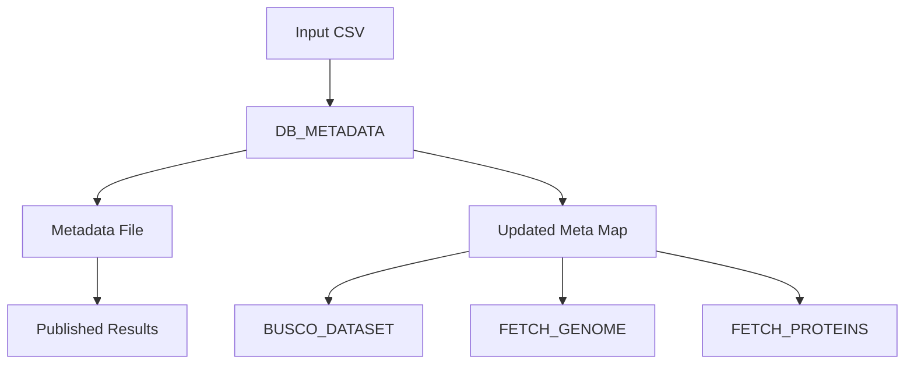

# DB_METADATA Module

## Overview

The `DB_METADATA` module extracts essential metadata from Ensembl core databases, including taxonomy ID, genome assembly accession (GCA), and production species name. This metadata is critical for downstream processes like BUSCO dataset selection and result organization.

**Module Location**: `pipelines/statistics/modules/db_metadata.nf`

## Functionality

This module queries an Ensembl core database to retrieve three key metadata fields:

1. **Taxonomy ID**: NCBI taxonomy identifier from the `meta` table
2. **GCA Accession**: Genome assembly accession from the `meta` table
3. **Production Name**: Scientific name in production format

The metadata is written to a file and propagated through the pipeline's metadata channel for use by downstream processes.

## Inputs

### Channel Input

```groovy
tuple val(meta)
```

**Metadata Map**:
```groovy
[
    gca: String,              // Genome assembly accession (may be "UNKNOWN")
    taxon_id: String,         // Taxonomy ID (may be "UNKNOWN")
    dbname: String,           // Ensembl core database name
    species_id: Integer,      // Species ID (default: 1)
    busco_mode: List,         // BUSCO mode(s) to run
    busco_dataset: String,    // BUSCO dataset (optional)
    genome_file: String,      // Path to genome file (optional)
    protein_file: String      // Path to protein file (optional)
]
```

### Parameters

| Parameter | Type | Default | Description |
|-----------|------|---------|-------------|
| `params.mysqlUrl` | String | Required | MySQL connection URL (e.g., `mysql://server:4157/`) |
| `params.mysqluser` | String | Required | MySQL username for database access |
| `params.mysqlpass` | String | `''` | MySQL password (optional if using SSH tunnel) |
| `params.outdir` | String | `./results` | Base output directory |

## Outputs

### Channel Outputs

| Channel | Type | Description |
|---------|------|-------------|
| `metadata` | `tuple val(meta), path("*metadata.txt")` | Original metadata + metadata file |
| `versions_file` | `path("versions.yml")` | Software versions used |

### File Outputs

#### Metadata File

**Location**: `${params.outdir}/${meta.dbname}/*metadata.txt`

**Format**: Plain text with key-value pairs

**Content Example**:
```text
taxon_id=9606
gca=GCA_000001405.29
production_name=homo_sapiens
```

**Fields**:
- `taxon_id`: NCBI taxonomy ID from `meta` table
- `gca`: Genome assembly accession from `meta` table (key: `assembly.accession`)
- `production_name`: Production species name from `meta` table (key: `species.production_name`)

#### Versions File

**Location**: `${params.outdir}/${meta.dbname}/versions.yml`

**Format**: YAML

**Content Example**:
```yaml
"DB_METADATA":
    python: 3.11.0
```

## Process Configuration

### Directives

```groovy
scratch false                // Don't use scratch directory
label 'python'               // Use Python resource allocation
tag "${meta.dbname}"         // Tag with database name
```

### Resource Allocation

From `nextflow.config` (`python` label):

- **CPUs**: 2
- **Memory**: 4 GB
- **Time**: 2 hours
- **Queue**: Standard

### Container

```
ensemblorg/ensembl-genes-metadata:latest
```

**Base Image**: Ubuntu 20.04  
**Python Version**: 3.11  
**MySQL Client**: Installed  
**Python Libraries**: `pymysql`, `pandas`

## Implementation Details

### Database Query

The module executes three MySQL queries against the `meta` table:

```sql
-- Get taxonomy ID
SELECT meta_value 
FROM meta 
WHERE species_id = ${meta.species_id} 
  AND meta_key = 'species.taxonomy_id';

-- Get GCA accession
SELECT meta_value 
FROM meta 
WHERE species_id = ${meta.species_id} 
  AND meta_key = 'assembly.accession';

-- Get production name
SELECT meta_value 
FROM meta 
WHERE species_id = ${meta.species_id} 
  AND meta_key = 'species.production_name';
```

### Python Script Logic

The `db_metadata.py` script:

1. Connects to MySQL using provided credentials
2. Queries the `meta` table for each metadata field
3. Handles missing values gracefully (returns "UNKNOWN")
4. Writes results to a text file
5. Captures Python version for reproducibility

### Metadata Propagation

The output metadata map is enriched by downstream processes:

```groovy
DB_METADATA(data).metadata.map { meta, metadata_file ->
    def lines = metadata_file.text.readLines()
    def new_taxon = lines[0].split('=')[1]
    def new_gca = lines[1].split('=')[1]
    def production_name = lines[2].split('=')[1]
    def updated_meta = meta + [
        taxon_id: new_taxon, 
        gca: new_gca, 
        production_species: production_name
    ]
    updated_meta
}
```

## Usage Example

### In a Workflow

```groovy
include { DB_METADATA } from '../modules/db_metadata.nf'

workflow {
    // Create input channel
    def input_ch = channel.of([
        gca: 'UNKNOWN',
        taxon_id: 'UNKNOWN',
        dbname: 'homo_sapiens_core_110_38',
        species_id: 1,
        busco_mode: ['genome', 'protein'],
        busco_dataset: '',
        genome_file: '',
        protein_file: ''
    ])
    
    // Run DB_METADATA
    def metadata_ch = DB_METADATA(input_ch).metadata
    
    // Use the enriched metadata
    metadata_ch.map { meta, metadata_file ->
        def lines = metadata_file.text.readLines()
        def taxon_id = lines[0].split('=')[1]
        def gca = lines[1].split('=')[1]
        def production_name = lines[2].split('=')[1]
        println "Species: ${production_name} (${gca}, NCBI:${taxon_id})"
    }
}
```

### Expected Output

**Console Output**:
```
Species: homo_sapiens (GCA_000001405.29, NCBI:9606)
```

**File Created**: `results/homo_sapiens_core_110_38/homo_sapiens_core_110_38_metadata.txt`

## Error Handling

### Common Errors

#### 1. Database Connection Failure

**Error Message**:
```
ERROR ~ Error executing process > 'DB_METADATA (homo_sapiens_core_110_38)'
Can't connect to MySQL server on 'host'
```

**Solution**:
- Verify `params.mysqlUrl` is correct
- Check network connectivity to database server
- Verify SSH tunnel is active (if using port forwarding)
- Confirm username and password are correct

#### 2. Missing Metadata Keys

**Error Message**:
```
WARNING: Missing meta key 'assembly.accession' for species_id=1
```

**Behavior**: Process continues but writes "UNKNOWN" for missing values

**Solution**: Verify the database contains expected metadata:
```sql
SELECT meta_key, meta_value 
FROM meta 
WHERE species_id = 1 
  AND meta_key IN ('species.taxonomy_id', 'assembly.accession', 'species.production_name');
```

#### 3. Invalid Species ID

**Error Message**:
```
No metadata found for species_id=999
```

**Solution**: Verify `species_id` exists in the database:
```sql
SELECT DISTINCT species_id FROM meta;
```

#### 4. Database Name Mismatch

**Error Message**:
```
Database 'homo_sapiens_core_999_99' does not exist
```

**Solution**: 
- Check database name spelling
- List available databases: `SHOW DATABASES LIKE '%core%';`
- Update input CSV with correct database name

## Version Tracking

The module captures software versions in `versions.yml`:

```yaml
"DB_METADATA":
    python: 3.11.0
```

**Captured Versions**:
- Python interpreter version
- (Future): `pymysql` library version

## Integration with Other Modules

### Upstream Modules

**None** - This is typically the first module in the workflow.

### Downstream Modules

The metadata extracted by this module is used by:

1. **BUSCO_DATASET**: Uses `taxon_id` to select appropriate BUSCO lineage
2. **FETCH_GENOME**: Uses `gca` to download genome assembly from NCBI
3. **FETCH_PROTEINS**: Uses `dbname` to extract protein sequences
4. **All Analysis Modules**: Use `production_name` for file naming and organization

### Data Flow Diagram



## Best Practices

### 1. Database Connection Management

**Use SSH Tunneling for Remote Databases**:
```bash
# Open SSH tunnel
ssh -L 4157:mysql-server:3306 user@gateway-server -N &

# Configure Nextflow
nextflow run main.nf \
    --mysqlUrl "mysql://localhost:4157/" \
    --mysqluser "ensro" \
    --mysqlpass ""
```

### 2. Species ID Handling

For **multi-species databases** (collections), use correct `species_id`:

```csv
dbname,species_id,busco_dataset
collection_core_110_1,1,bacteria_odb10
collection_core_110_1,2,bacteria_odb10
```

### 3. Error Resilience

Add error handling in workflows:

```groovy
DB_METADATA(data).metadata
    .filter { meta, file ->
        def content = file.text
        if (content.contains("UNKNOWN")) {
            log.warn "Missing metadata for ${meta.dbname}"
            return false
        }
        return true
    }
    .set { valid_metadata }
```

### 4. Caching Metadata

Since metadata rarely changes, consider caching:

```groovy
process DB_METADATA {
    // Add this directive to cache results
    cache 'lenient'  // Re-use cached results even if script changes
    
    // Or use storeDir for permanent caching
    storeDir "${params.cacheDir}/metadata"
    
    // ... rest of process
}
```

## Performance Considerations

### Execution Time

Typical execution time: **5-15 seconds** per database

**Factors affecting performance**:
- Database server load
- Network latency
- Number of concurrent queries

### Parallelization

This module can process multiple databases in parallel:

```groovy
// Input: 10 databases
channel.fromPath('databases.csv')
    .splitCsv(header: true)
    .map { row -> [dbname: row.dbname, species_id: row.species_id] }
    | DB_METADATA  // Runs 10 instances in parallel
```

**Recommended concurrency**: 10-20 parallel instances

### Resource Usage

**Minimal resources required**:
- **CPU**: < 5% utilization
- **Memory**: < 100 MB
- **Disk**: < 1 KB output per database
- **Network**: < 10 KB data transfer

## Testing

### Unit Test

Test metadata extraction for a known database:

```bash
# Test with homo_sapiens core
nextflow run pipelines/statistics/main.nf \
    --run_busco_core \
    --csvFile test_data/test_db_metadata.csv \
    --mysqlUrl "mysql://ensembldb.ensembl.org:3306/" \
    --mysqluser "anonymous" \
    --mysqlpass "" \
    -entry BUSCO \
    --max_cpus 2 \
    --max_memory 4.GB \
    -process.executor 'local'
```

**test_db_metadata.csv**:
```csv
dbname,species_id,busco_dataset
homo_sapiens_core_110_38,1,vertebrata_odb10
```

### Expected Test Result

**File**: `results/homo_sapiens_core_110_38/homo_sapiens_core_110_38_metadata.txt`

```text
taxon_id=9606
gca=GCA_000001405.29
production_name=homo_sapiens
```

### Validation

Verify metadata values match database:

```bash
# Query database directly
mysql -h ensembldb.ensembl.org -u anonymous -e \
  "SELECT meta_key, meta_value FROM homo_sapiens_core_110_38.meta 
   WHERE meta_key IN ('species.taxonomy_id', 'assembly.accession', 'species.production_name');"

# Compare with extracted metadata
cat results/homo_sapiens_core_110_38/homo_sapiens_core_110_38_metadata.txt
```

## Troubleshooting

### Debug Mode

Enable detailed MySQL logging:

```groovy
script:
"""
python ${moduleDir}/bin/db_metadata.py \\
    --mysql_host ${params.mysqlUrl} \\
    --mysql_database "${meta.dbname}" \\
    --mysql_user "${params.mysqluser}" \\
    --mysql_pass "${params.mysqlpass}" \\
    --species_id "${meta.species_id}" \\
    --verbose  # Add verbose flag
"""
```

### Check Database Access

Test connection manually:

```bash
mysql -h ensembldb.ensembl.org -u anonymous -e "SHOW DATABASES LIKE '%core%';"
```

### Inspect Metadata Table

Examine available metadata keys:

```sql
USE homo_sapiens_core_110_38;
SELECT meta_key, COUNT(*) as count 
FROM meta 
GROUP BY meta_key 
HAVING meta_key LIKE 'species.%' OR meta_key LIKE 'assembly.%';
```

## Related Documentation

- [BUSCO_DATASET Module](busco-dataset.md) - Uses taxonomy ID for dataset selection
- [FETCH_GENOME Module](fetch-genome.md) - Uses GCA for genome download
- [FETCH_PROTEINS Module](fetch-proteins.md) - Uses database name for protein extraction
- [BUSCO Workflow](../workflows/busco.md) - Complete workflow using this module

## References

- [Ensembl Database Schema](https://www.ensembl.org/info/docs/api/core/core_schema.html) - Core database structure
- [NCBI Taxonomy](https://www.ncbi.nlm.nih.gov/taxonomy) - Taxonomy ID reference
- [GCA Accessions](https://www.ncbi.nlm.nih.gov/assembly) - Genome assembly accessions

---

**Last Updated**: 2026-02-06  
**Module Version**: 1.0.0  
**Maintained By**: Ensembl Genes Team
