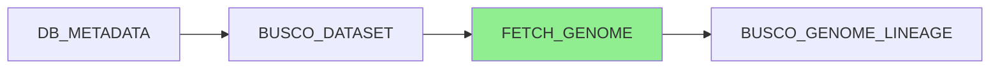

# FETCH_GENOME Module

## Overview

The `FETCH_GENOME` module downloads genome assembly sequences from NCBI in FASTA format using the GenBank Assembly (GCA) accession. It supports both direct file paths and automated downloads from NCBI's FTP server. Downloaded genomes are decompressed if necessary and made available for downstream quality assessment tools like BUSCO.

**Module Location**: `pipelines/statistics/modules/fetch_genome.nf`

## Functionality

This module performs two key functions:

1. **Direct File Access**: If `meta.genome_file` is provided, uses the specified file directly
2. **NCBI Download**: If no file is provided, automatically downloads from NCBI using GCA accession

The module handles:
- Genome download from NCBI FTP servers
- Decompression of `.gz` files
- File naming and organization
- Checksum validation (when available)

## Inputs

### Channel Input

```groovy
tuple val(meta)
```

**Metadata Map**:
```groovy
[
    gca: String,                     // REQUIRED: GCA accession (e.g., "GCA_000001405.29")
    dbname: String,                  // Database name
    species_id: Integer,             // Species ID
    taxon_id: String,                // Taxonomy ID
    production_species: String,      // Production name (from DB_METADATA)
    busco_dataset: String,           // BUSCO dataset
    genome_file: String              // Optional: Direct path to genome file
]
```

### Parameters

| Parameter | Type | Default | Description |
|-----------|------|---------|-------------|
| `params.outdir` | String | `./results` | Base output directory |
| `params.cacheDir` | String | `./results/cache` | Directory for cached process outputs |

## Outputs

### Channel Outputs

| Channel | Type | Description |
|---------|------|-------------|
| `genome_file_output` | `tuple val(meta), path("*.fna")` | Metadata + genome FASTA file |
| `versions_file` | `path("versions.yml")` | Software versions used |

### File Outputs

#### Genome FASTA File

**Location**: `${params.cacheDir}/${meta.gca}/ncbi_dataset/*.fna`

**Naming Convention**: 
- NCBI/ENA downloads keep their source FASTA filename
- Direct input files are copied as `genome.fna`

**Format**: Standard FASTA format

**Content Example**:
```
>CM000663.2 Homo sapiens chromosome 1, GRCh38.p14 Primary Assembly
NNNNNNNNNNNNNNNNNNNNNNNNNNNNNNNNNNNNNNNNNNNNNNNNNNNNNN
ATCGATCGATCGATCGATCGATCGATCGATCGATCGATCGATCGATCGATCG
...
```

**File Size**: Varies (50 MB - 10 GB typical range)

#### Versions File

**Location**: `${params.cacheDir}/${meta.gca}/ncbi_dataset/versions.yml`

**Format**: YAML

**Content Example**:
```yaml
"FETCH_GENOME":
    wget: 1.21.3
    gzip: 1.12
```

## Process Configuration

### Directives

```groovy
label 'fetch_file'             // Use fetch_file resource allocation
tag "${meta.gca}"              // Tag with GCA accession
storeDir "${params.cacheDir}/${meta.gca}/ncbi_dataset"
```

### Resource Allocation

From `nextflow.config` (`fetch_file` label):

- **CPUs**: 2
- **Memory**: 2 GB
- **Time**: 4 hours
- **Queue**: Standard

### Container

```
ensemblorg/ensembl-genes-metadata:latest
```

**Installed Tools**:
- `wget` - For downloading from NCBI FTP
- `gzip` - For decompression
- `md5sum` - For checksum validation

## Implementation Details

### NCBI FTP Structure

NCBI genomes are hosted at:
```
https://ftp.ncbi.nlm.nih.gov/genomes/all/
```

**URL Pattern**:
```
https://ftp.ncbi.nlm.nih.gov/genomes/all/GCA/{XXX}/{YYY}/{ZZZ}/GCA_XXXXXXXXX.Y_{assembly_name}/
```

**Example**:
```
# GCA_000001405.29 -> GCA/000/001/405/GCA_000001405.29_GRCh38.p14/
https://ftp.ncbi.nlm.nih.gov/genomes/all/GCA/000/001/405/GCA_000001405.29_GRCh38.p14/GCA_000001405.29_GRCh38.p14_genomic.fna.gz
```

### Download Logic

The module uses a bash script to:

1. **Check for Direct File**:
   ```bash
   if [ -n "${meta.genome_file}" ]; then
       # Use provided file
       cp -L ${meta.genome_file} genome.fna
   else
       # Download from NCBI
   fi
   ```

2. **Parse GCA Accession**:
   ```bash
   GCA=${meta.gca}
   PREFIX1=${GCA:4:3}  # First 3 digits
   PREFIX2=${GCA:7:3}  # Next 3 digits  
   PREFIX3=${GCA:10:3} # Next 3 digits
   ```

3. **Construct NCBI URL**:
   ```bash
   BASE_URL="https://ftp.ncbi.nlm.nih.gov/genomes/all"
   ASSEMBLY_URL="${BASE_URL}/GCA/${PREFIX1}/${PREFIX2}/${PREFIX3}/${GCA}_*"
   ```

4. **Download Genome**:
   ```bash
   wget -r -np -nd -A "*_genomic.fna.gz" ${ASSEMBLY_URL}
   ```

5. **Decompress**:
   ```bash
   if [ -f *.fna.gz ]; then
       gunzip *.fna.gz
   fi
   ```

### Caching Strategy

The module uses `storeDir` to cache the downloaded `*.fna` and `versions.yml` under `${params.cacheDir}/${meta.gca}/ncbi_dataset/`. When those outputs already exist, Nextflow can reuse them instead of running the download task body.

Nextflow `-resume` is still required for the standard `work/` cache, but `storeDir` provides this module-level persistent cache across runs.

**Cache Location**: `${params.cacheDir}/GCA_XXXXXXXXX.Y/ncbi_dataset/`

## Usage Example

### In a Workflow

```groovy
include { FETCH_GENOME } from '../modules/fetch_genome.nf'

workflow {
    // Create input channel with GCA accession
    def input_ch = channel.of([
        gca: 'GCA_000001405.29',
        dbname: 'homo_sapiens_core_110_38',
        species_id: 1,
        taxon_id: '9606',
        production_species: 'homo_sapiens',
        busco_dataset: 'vertebrata_odb10',
        genome_file: ''  // Empty = download from NCBI
    ])
    
    // Fetch genome
    def genome_ch = FETCH_GENOME(input_ch).genome_file_output
    
    // Use genome file
    genome_ch.view { meta, fna_file ->
        "Downloaded genome for ${meta.production_species}: ${fna_file}"
    }
}
```

### With Direct File Path

```groovy
workflow {
    // Use pre-downloaded genome file
    def input_ch = channel.of([
        gca: 'GCA_000001405.29',
        dbname: 'homo_sapiens_core_110_38',
        species_id: 1,
        taxon_id: '9606',
        production_species: 'homo_sapiens',
        busco_dataset: 'vertebrata_odb10',
        genome_file: '/data/genomes/human_genome.fna.gz'
    ])
    
    FETCH_GENOME(input_ch)
}
```

### Expected Output

**Console Output**:
```
Downloaded genome for homo_sapiens: /path/to/cache/GCA_000001405.29/GCA_000001405.29_GRCh38.p14_genomic.fna
```

**Cached File**: `cache/GCA_000001405.29/GCA_000001405.29_GRCh38.p14_genomic.fna`

**File Size**: ~3.1 GB (uncompressed)

## Error Handling

### Common Errors

#### 1. Invalid GCA Accession

**Error Message**:
```
HTTP request sent, awaiting response... 404 Not Found
```

**Cause**: GCA accession doesn't exist on NCBI FTP server

**Solution**:
- Verify GCA accession at [NCBI Assembly](https://www.ncbi.nlm.nih.gov/assembly)
- Check for typos in accession number
- Ensure full accession with version (e.g., `GCA_000001405.29`, not `GCA_000001405`)

#### 2. Network Timeout

**Error Message**:
```
failed: Connection timed out.
Retrying.
```

**Solution**:
- Check internet connectivity
- Increase timeout: `wget --timeout=600`
- Try alternative NCBI mirror
- Consider using `--genome_file` parameter with pre-downloaded genome

#### 3. Insufficient Disk Space

**Error Message**:
```
No space left on device
```

**Solution**:
- Check available disk space: `df -h`
- Clean cache directory: `rm -rf cache/GCA_*`
- Use different cache location: `--cacheDir /path/to/larger/disk`

#### 4. Corrupted Download

**Error Message**:
```
gzip: invalid compressed data--format violated
```

**Solution**:
```bash
# Remove corrupted file
rm cache/GCA_XXXXXXXXX.Y/*.fna.gz

# Re-run pipeline (will re-download)
nextflow run main.nf -resume
```

#### 5. Missing Assembly on NCBI

**Error Message**:
```
No matches found for GCA_XXXXXXXXX.Y
```

**Cause**: Assembly removed or suppressed by NCBI

**Solution**:
- Check assembly status at NCBI
- Look for replacement assembly
- Download genome manually and use `--genome_file` parameter

## Version Tracking

The module captures software versions:

```yaml
"FETCH_GENOME":
    wget: 1.21.3
    gzip: 1.12
```

**Captured Versions**:
- `wget` version used for download
- `gzip` version used for decompression

## Integration with Other Modules

### Upstream Modules

1. **DB_METADATA**: Provides `gca` accession and production name
2. **BUSCO_DATASET**: Provides BUSCO dataset information

### Downstream Modules

1. **BUSCO_GENOME_LINEAGE**: Uses genome file for BUSCO assessment

### Data Flow Diagram



## Best Practices

### 1. Use Shared Cache

For multi-user environments, use a shared cache:

```bash
# Create shared cache directory
mkdir -p /shared/data/genome_cache
chmod 775 /shared/data/genome_cache

# Configure pipeline
nextflow run main.nf \
    --cacheDir /shared/data/genome_cache
```

### 2. Pre-download Large Genomes

For large genomes (>5 GB), pre-download to avoid timeouts:

```bash
# Download manually
wget https://ftp.ncbi.nlm.nih.gov/genomes/all/GCA/XXX/YYY/ZZZ/GCA_*_genomic.fna.gz

# Use in pipeline
nextflow run main.nf \
    --genome_file /data/genomes/large_genome.fna.gz
```

### 3. Monitor Disk Usage

Genomes can consume significant disk space:

```bash
# Check cache size
du -sh cache/

# List largest genomes
du -h cache/GCA_* | sort -h | tail -10

# Clean old genomes (older than 30 days)
find cache/ -name "*.fna" -mtime +30 -delete
```

### 4. Validate Downloaded Genomes

Verify genome integrity after download:

```bash
# Check FASTA format
head -n 1 cache/GCA_000001405.29/*.fna
# Should start with '>'

# Count sequences
grep -c "^>" cache/GCA_000001405.29/*.fna

# Check file size
ls -lh cache/GCA_000001405.29/*.fna
```

## Performance Considerations

### Download Times

Typical download times (100 Mbps connection):

| Genome Size | Compressed | Uncompressed | Download Time | Decompression |
|-------------|------------|--------------|---------------|---------------|
| Small (10 MB) | 3 MB | 10 MB | 10 seconds | 5 seconds |
| Medium (100 MB) | 30 MB | 100 MB | 1 minute | 30 seconds |
| Large (1 GB) | 300 MB | 1 GB | 5 minutes | 3 minutes |
| Very Large (10 GB) | 3 GB | 10 GB | 30 minutes | 20 minutes |

### Parallelization

Multiple genomes can be downloaded in parallel:

```groovy
// Download 10 genomes simultaneously
channel.fromPath('genomes.csv')
    .splitCsv(header: true)
    .map { row -> [gca: row.gca, /*...*/] }
    | FETCH_GENOME  // Downloads in parallel
```

**Recommended concurrency**: 5-10 simultaneous downloads

**Network consideration**: Limit concurrent downloads to avoid overwhelming NCBI servers

### Caching Benefits

With `storeDir` caching:

- **First run**: Full download time (minutes to hours)
- **Subsequent runs**: Reuses the stored `.fna` from the store directory without downloading again
- **Cache hit rate**: Typically >80% for repeated analyses

### Resource Usage

**During download**:
- **CPU**: <10% (wget is I/O bound)
- **Memory**: <100 MB
- **Disk I/O**: Write speed limited by network
- **Network**: Full available bandwidth

**During decompression**:
- **CPU**: 100% (single-threaded gzip)
- **Memory**: <500 MB
- **Disk I/O**: Heavy write activity

## Advanced Features

### Custom NCBI Mirror

Use alternative NCBI mirror for faster downloads:

```groovy
script:
"""
# Use European mirror
NCBI_MIRROR="ftp.ebi.ac.uk/pub/databases/genbank"

wget \${NCBI_MIRROR}/genomes/all/GCA/...
"""
```

### Checksum Validation

Add MD5 checksum validation:

```groovy
script:
"""
# Download genome and checksum
wget ${ASSEMBLY_URL}/*_genomic.fna.gz
wget ${ASSEMBLY_URL}/md5checksums.txt

# Validate
md5sum -c md5checksums.txt
"""
```

### Compressed Output

Keep genome compressed to save disk space:

```groovy
output:
path("*.fna.gz"), emit: genome_file_output

script:
"""
# Skip decompression step
wget ${ASSEMBLY_URL}/*_genomic.fna.gz
# Don't gunzip - use compressed file
"""
```

**Note**: Downstream tools must support `.gz` input

## Testing

### Unit Test

Test genome download for a small genome:

```bash
# Test with E. coli genome (small, fast download)
nextflow run pipelines/statistics/main.nf \
    --run_busco_ncbi \
    --csvFile test_data/test_fetch_genome.csv \
    --cacheDir ./test_cache \
    --outdir ./test_results \
    --max_cpus 2 \
    -entry BUSCO \
    -process.executor 'local'
```

**test_fetch_genome.csv**:
```csv
gca,taxon_id,species_id,busco_dataset,genome_file,protein_file
GCA_000005845.2,511145,1,bacteria_odb10,,
```

### Expected Test Result

**File**: `test_cache/GCA_000005845.2/GCA_000005845.2_ASM584v2_genomic.fna`

**File Size**: ~4.6 MB

**Sequences**: ~400 (chromosome + plasmids + scaffolds)

### Validation

Verify genome download:

```bash
# Check file exists
ls -lh test_cache/GCA_000005845.2/*.fna

# Count sequences
grep -c "^>" test_cache/GCA_000005845.2/*.fna

# Check sequence headers
grep "^>" test_cache/GCA_000005845.2/*.fna | head -5
```

Expected headers:
```
>U00096.3 Escherichia coli str. K-12 substr. MG1655, complete genome
```

## Troubleshooting

### Debug Mode

Enable verbose wget output:

```groovy
script:
"""
wget -v -r -np -nd -A "*_genomic.fna.gz" ${ASSEMBLY_URL}
"""
```

### Check NCBI FTP Availability

Test NCBI FTP access:

```bash
# Test connection
curl -I https://ftp.ncbi.nlm.nih.gov/genomes/

# List available assemblies for a GCA
curl -s https://ftp.ncbi.nlm.nih.gov/genomes/all/GCA/000/001/405/ | grep "GCA_000001405"
```

### Manual Download

Download genome manually for troubleshooting:

```bash
# Find assembly directory
GCA="GCA_000001405.29"
curl -s https://ftp.ncbi.nlm.nih.gov/genomes/all/GCA/000/001/405/ | grep ${GCA}

# Download genome
wget https://ftp.ncbi.nlm.nih.gov/genomes/all/GCA/000/001/405/GCA_000001405.29_GRCh38.p14/GCA_000001405.29_GRCh38.p14_genomic.fna.gz

# Decompress
gunzip GCA_000001405.29_GRCh38.p14_genomic.fna.gz

# Use in pipeline
nextflow run main.nf --genome_file $(pwd)/GCA_000001405.29_GRCh38.p14_genomic.fna
```

## Related Documentation

- [DB_METADATA Module](db-metadata.md) - Provides GCA accession
- [BUSCO_GENOME_LINEAGE Module](busco-genome-lineage.md) - Uses genome file for assessment
- [BUSCO Workflow](../workflows/busco.md) - Complete workflow using this module

## References

- [NCBI Assembly Database](https://www.ncbi.nlm.nih.gov/assembly) - Assembly search and information
- [NCBI FTP Structure](https://www.ncbi.nlm.nih.gov/genomes/all/) - FTP directory organization
- [BUSCO Documentation](https://busco.ezlab.org/) - BUSCO genome mode requirements

---

**Last Updated**: 2026-02-06  
**Module Version**: 1.0.0  
**Maintained By**: Ensembl Genes Team
