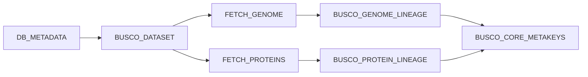
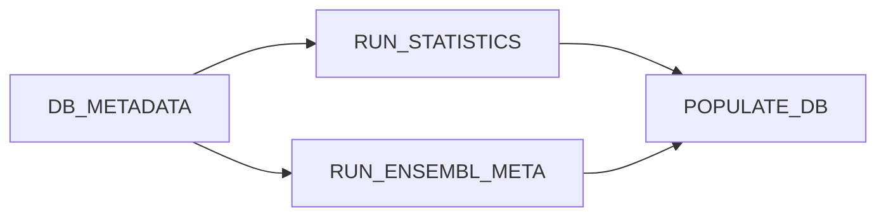

# Statistics Pipeline Modules

This section provides detailed documentation for each module in the Statistics Pipeline. Modules are reusable Nextflow processes that perform specific tasks within the pipeline workflows.

## 📋 Module Overview

The Statistics Pipeline contains **14 modules** organized into three functional categories:

### Data Retrieval Modules

Modules responsible for fetching input data from databases and external sources:

| Module | Purpose | Documentation |
|--------|---------|---------------|
| **DB_METADATA** | Extract metadata from Ensembl databases | [View Docs](db-metadata.md) |
| **FETCH_GENOME** | Download genome assemblies from NCBI | [View Docs](fetch-genome.md) |
| **FETCH_PROTEINS** | Extract protein sequences from databases | [View Docs](fetch-proteins.md) |

### Analysis Modules

Modules that perform quality assessment and statistical analyses:

| Module | Purpose | Documentation |
|--------|---------|---------------|
| **BUSCO_DATASET** | Select appropriate BUSCO lineage dataset | [View Docs](busco-dataset.md) |
| **BUSCO_GENOME_LINEAGE** | Run BUSCO on genome assemblies | [View Docs](busco-genome-lineage.md) |
| **BUSCO_PROTEIN_LINEAGE** | Run BUSCO on protein sequences | [View Docs](busco-protein-lineage.md) |
| **OMAMER_HOG** | Generate HOG assignments with OMAmer | [View Docs](omamer-hog.md) |
| **OMARK** | Assess proteome quality with OMArk | [View Docs](omark.md) |
| **RUN_STATISTICS** | Generate Ensembl assembly statistics | [View Docs](run-statistics.md) |
| **RUN_ENSEMBL_META** | Generate Ensembl metadata statistics | [View Docs](run-ensembl-meta.md) |

### Database Integration Modules

Modules for storing results in Ensembl databases:

| Module | Purpose | Documentation |
|--------|---------|---------------|
| **BUSCO_CORE_METAKEYS** | Insert BUSCO results into core database | [View Docs](busco-core-metakeys.md) |
| **POPULATE_DB** | Load statistics into database | [View Docs](populate-db.md) |

### Utility Modules

Supporting modules for pipeline operations:

| Module | Purpose | Documentation |
|--------|---------|---------------|
| **CLEANING** | Clean up temporary files | [View Docs](cleaning.md) |

## 🔗 Module Usage by Workflow

### BUSCO Workflow

The [BUSCO workflow](../workflows/busco.md) uses these modules:



**Modules**: `DB_METADATA`, `BUSCO_DATASET`, `FETCH_GENOME`, `FETCH_PROTEINS`, `BUSCO_GENOME_LINEAGE`, `BUSCO_PROTEIN_LINEAGE`, `BUSCO_CORE_METAKEYS`

### OMArk Workflow

The [OMArk workflow](../workflows/omark.md) uses these modules:


**Modules**: `DB_METADATA`, `FETCH_PROTEINS`, `OMAMER_HOG`, `OMARK`

### Ensembl Stats Workflow

The [Ensembl Stats workflow](../workflows/ensembl-stats.md) uses these modules:



**Modules**: `DB_METADATA`, `RUN_STATISTICS`, `RUN_ENSEMBL_META`, `POPULATE_DB`

## 📖 Module Documentation Structure

Each module documentation page includes:

- **Overview**: Purpose and functionality
- **Inputs**: Required input channels and parameters
- **Outputs**: Generated output channels and files
- **Parameters**: Configuration options and defaults
- **Container**: Docker/Singularity image used
- **Resources**: CPU, memory, and time requirements
- **Example**: Usage example with sample data
- **Error Handling**: Common issues and troubleshooting
- **Version Tracking**: Software versions captured

## 🔧 Common Module Patterns

### Process Labels

Modules use labels to define resource requirements:

- `python` - Python-based processes (2 CPUs, 4GB RAM)
- `busco` - BUSCO analysis (8 CPUs, 16GB RAM)
- `omamer` - OMAmer/OMArk processes (4 CPUs, 8GB RAM)
- `fetch_file` - File retrieval (2 CPUs, 2GB RAM)
- `default` - Standard processes (1 CPU, 2GB RAM)

See [nextflow.config](https://github.com/Ensembl/ensembl-genes-nf/blob/feature/collection_tmp/pipelines/statistics/nextflow.config) for full resource definitions.

### Version Tracking

All modules emit a `versions.yml` file tracking software versions:

```yaml
"PROCESS_NAME":
    tool_name: version_number
    python: 3.11.0
```

This enables complete reproducibility and audit trails.

### Publishing Strategy

Modules use `publishDir` directives to control output locations:

- **Analysis Results**: `${params.outdir}/${meta.gca}/`
- **Cached Data**: `${params.cacheDir}/${meta.gca}/`
- **Stored Data**: `storeDir` for permanent caching

### Metadata Propagation

All modules receive and emit a `meta` map containing:

```groovy
[
    gca: "GCA_000001405.29",           // Genome assembly accession
    dbname: "homo_sapiens_core_110_38", // Database name
    species_id: 1,                      // Species ID in database
    taxon_id: "9606",                   // NCBI taxonomy ID
    production_name: "homo_sapiens",    // Production name
    busco_dataset: "vertebrata_odb10"   // BUSCO lineage
]
```

## 🚀 Quick Navigation

### By Function

- **[Data Retrieval](db-metadata.md)** - Fetch genomes, proteins, and metadata
- **[Quality Assessment](busco-dataset.md)** - BUSCO and OMArk analyses
- **[Statistics Generation](run-statistics.md)** - Ensembl statistics
- **[Database Operations](populate-db.md)** - Store results in databases

### By Tool

- **[BUSCO Modules](busco-dataset.md)** - All BUSCO-related processes
- **[OMArk Modules](omamer-hog.md)** - OMAmer and OMArk processes
- **[Ensembl Modules](run-statistics.md)** - Ensembl statistics generation

### Alphabetical

<div class="grid cards" markdown>

-   [**BUSCO_CORE_METAKEYS**](busco-core-metakeys.md)
    
    Insert BUSCO results into Ensembl core database

-   [**BUSCO_DATASET**](busco-dataset.md)
    
    Select appropriate BUSCO lineage dataset

-   [**BUSCO_GENOME_LINEAGE**](busco-genome-lineage.md)
    
    Run BUSCO assessment on genome assemblies

-   [**BUSCO_PROTEIN_LINEAGE**](busco-protein-lineage.md)
    
    Run BUSCO assessment on protein sequences

-   [**CLEANING**](cleaning.md)
    
    Clean up temporary files and directories

-   [**DB_METADATA**](db-metadata.md)
    
    Extract metadata from Ensembl databases

-   [**FETCH_GENOME**](fetch-genome.md)
    
    Download genome assemblies from NCBI

-   [**FETCH_PROTEINS**](fetch-proteins.md)
    
    Extract protein sequences from databases

-   [**OMAMER_HOG**](omamer-hog.md)
    
    Generate HOG assignments with OMAmer

-   [**OMARK**](omark.md)
    
    Assess proteome quality with OMArk

-   [**POPULATE_DB**](populate-db.md)
    
    Load statistics into Ensembl database

-   [**RUN_ENSEMBL_META**](run-ensembl-meta.md)
    
    Generate Ensembl metadata statistics

-   [**RUN_STATISTICS**](run-statistics.md)
    
    Generate comprehensive assembly statistics

</div>

## 📚 Additional Resources

- [Workflow Documentation](../workflows/busco.md) - How workflows use modules
- [Parameter Reference](../parameters.md) - Configuration options
- [Pipeline Overview](../overview.md) - Architecture and design
- [Source Code](https://github.com/Ensembl/ensembl-genes-nf/tree/feature/collection_tmp/pipelines/statistics/modules) - View module implementations

---

**Last Updated**: 2026-02-06  
**Pipeline Version**: 1.0.0
