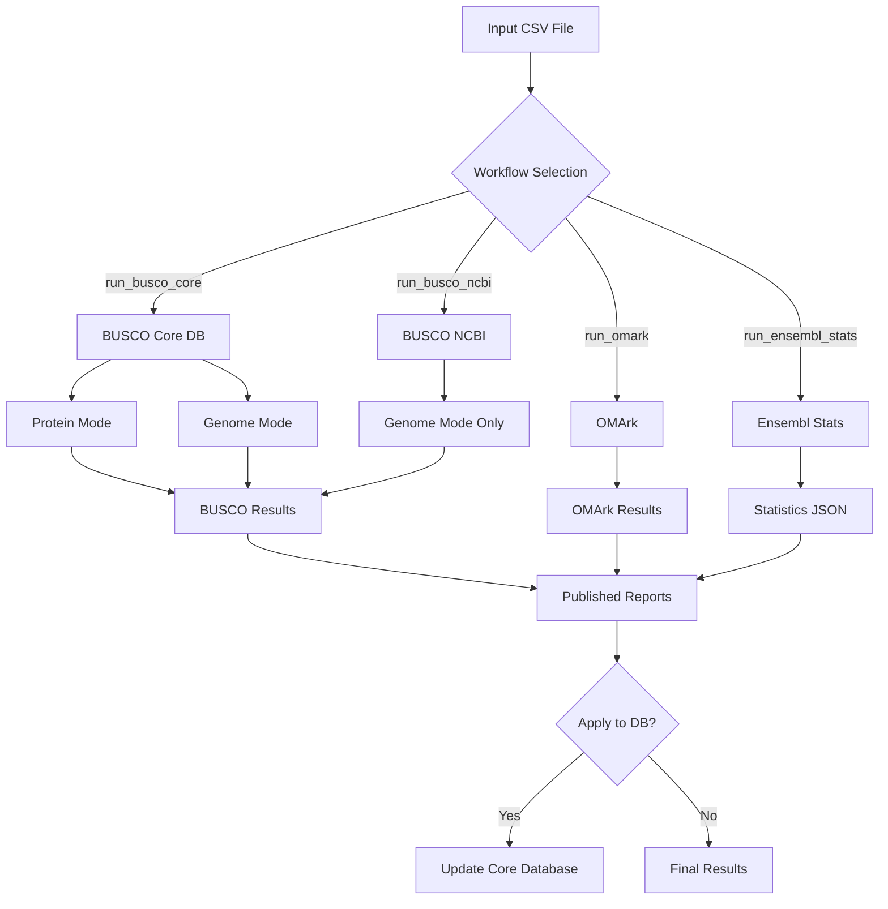

# Statistics Pipeline Overview

The Ensembl Genes Statistics pipeline is a comprehensive quality control and metrics generation workflow designed for genome annotation projects. It evaluates assembly quality, annotation completeness, and generates essential statistics for Ensembl core databases.

## Purpose

This pipeline serves multiple critical functions in the genome annotation workflow:

1. **Quality Assessment**: Evaluate the completeness and accuracy of genome assemblies and gene annotations
2. **Metrics Generation**: Compute standardized statistics for comparative genomics
3. **Database Integration**: Load metadata and statistics into Ensembl core databases
4. **Reproducibility**: Ensure consistent quality metrics across all Ensembl genomes

## Workflow Components

The pipeline consists of three main analytical workflows:

### 1. BUSCO Analysis

**Benchmarking Universal Single-Copy Orthologs (BUSCO)** provides quantitative measures of genome assembly and annotation completeness.

- **Protein Mode**: Assesses gene set completeness using canonical transcripts
- **Genome Mode**: Evaluates assembly quality by detecting conserved genes directly in the genome
- **Both Modes**: Comprehensive assessment of both assembly and annotation

**Key Outputs:**
- Complete/Single-copy genes
- Duplicated genes
- Fragmented genes
- Missing genes

[Learn more about BUSCO workflow →](workflows/busco.md)

### 2. OMArk Analysis

**Orthology MARKer (OMArk)** evaluates proteome completeness based on the presence of conserved genes from the target lineage.

- Uses the OMAmer database for orthology detection
- Provides lineage-specific completeness metrics
- Identifies potentially contaminated or misassigned sequences

**Key Outputs:**
- Proteome completeness score
- Conserved genes presence/absence
- Detailed summary statistics

[Learn more about OMArk workflow →](workflows/omark.md)

### 3. Ensembl Statistics

Generates comprehensive gene set statistics for Ensembl core databases.

- **Statistics Generation**: Core metrics including gene counts, transcript counts, etc.
- **Beta Metakeys**: Additional metadata for beta releases
- **Database Loading**: Optional automatic insertion of statistics into the database

**Key Outputs:**
- Gene and transcript counts
- Exon and intron statistics
- Protein-coding vs. non-coding gene ratios
- Assembly statistics

[Learn more about Ensembl Stats workflow →](workflows/ensembl-stats.md)

## Pipeline Architecture



## Flexible Execution

The pipeline is designed to be modular—you can run individual workflows or any combination:

| Workflow | Parameter | Description |
|----------|-----------|-------------|
| BUSCO (Core DB) | `--run_busco_core` | Run BUSCO using MySQL core database |
| BUSCO (NCBI) | `--run_busco_ncbi` | Run BUSCO using NCBI assembly accession |
| OMArk | `--run_omark` | Run OMArk proteome assessment |
| Ensembl Stats | `--run_ensembl_stats` | Generate Ensembl statistics |
| Beta Metakeys | `--run_ensembl_beta_metakeys` | Generate beta metadata |

## Input Requirements

The pipeline uses a CSV file to specify samples and their metadata. Each row represents one genome to be analyzed.

**Required columns vary by workflow:**

- **BUSCO Core**: `dbname`, `species_id`, `busco_dataset`, `taxon_id`
- **BUSCO NCBI**: `gca`, `taxon_id`, `busco_dataset`
- **OMArk**: `dbname`, `species_id`, `taxon_id`
- **Ensembl Stats**: `dbname`, `species_id`

[View detailed input specifications →](input.md)

## Output Structure

```
results/
├── busco/
│   ├── {sample}_busco_short_summary.txt
│   ├── {sample}_genome_busco_short_summary.txt
├── omark/
│   └── omark_proteins_detailed_summary.txt
├── ensembl_stats/
│   └── {sample}_statistics.json
└── pipeline_info/
    ├── software_versions.yml
    └── execution_trace.txt
```

[View detailed output documentation →](output.md)

## Use Cases

### 1. Quality Control for New Annotations
```bash
nextflow run main.nf \
  --csvFile genomes.csv \
  --run_busco_core \
  --run_omark \
  --outdir qc_results
```

### 2. Quick Assembly Assessment from NCBI
```bash
nextflow run main.nf \
  --csvFile ncbi_assemblies.csv \
  --run_busco_ncbi \
  --outdir ncbi_qc
```

### 3. Statistics Generation for Database Release
```bash
nextflow run main.nf \
  --csvFile production_dbs.csv \
  --run_ensembl_stats \
  --apply_ensembl_stats \
  --outdir stats_output
```

## Next Steps

- [Quick Start Guide](quickstart.md) - Get running in minutes
- [Parameters Reference](parameters.md) - Complete parameter documentation
- [Input Format](input.md) - Detailed input file specifications
- [Troubleshooting](troubleshooting.md) - Common issues and solutions
