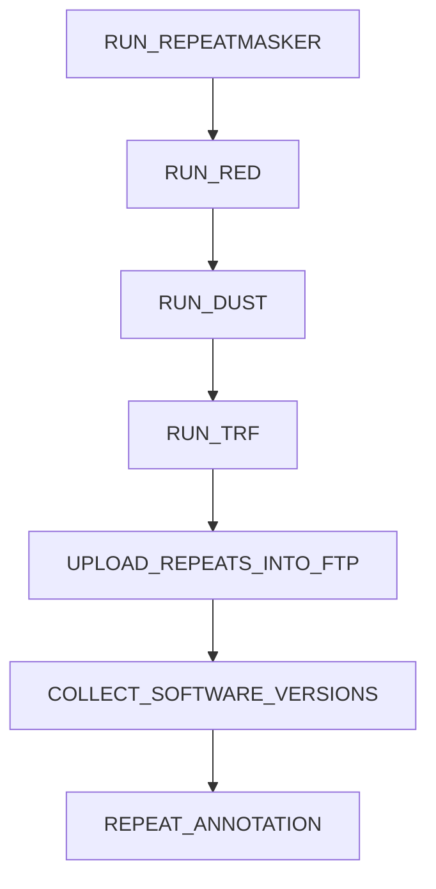

<!--
AUTO-GENERATED FILE.

Generated by docs/generate_docs.py

Do not edit manually.
-->

# Main

regarding copyright ownership.
you may not use this file except in compliance with the License.
You may obtain a copy of the License at
distributed under the License is distributed on an "AS IS" BASIS,
See the License for the specific language governing permissions and
limitations under the License.
REPEAT ANNOTATION PIPELINE
This workflow performs comprehensive repeat annotation on genome assemblies using
RepeatModeler for library generation and RepeatMasker/DustMasker/TRF for repeat identification.
Pipeline Stages:
1. FETCH_GENOME           - Download genome assemblies from NCBI
2. FETCH_REPEAT_MODEL     - Check for existing RepeatModeler libraries
3a. GENERATE_REPEATMODELER_LIBRARY - Generate de novo libraries for genomes without existing ones
3b. CHECK_AND_DOWNLOAD_RMLIBRARY   - Download pre-computed libraries when available
4. RUN_REPEATMASKER       - Identify and mask repeats using combined libraries
Input:
CSV file with columns: species_name, GCA_accession
Output:
- Downloaded genome assemblies
- RepeatModeler libraries (generated or downloaded)
- RepeatMasker annotation results (masked sequences, GTF files, statistics)
MAIN WORKFLOW
ENTRY WORKFLOW

## Overview

This workflow invokes **7** modules.

## Modules

| Order | Module |
|------:|--------|
| 1 | `RUN_REPEATMASKER` |
| 2 | `RUN_RED` |
| 3 | `RUN_DUST` |
| 4 | `RUN_TRF` |
| 5 | `UPLOAD_REPEATS_INTO_FTP` |
| 6 | `COLLECT_SOFTWARE_VERSIONS` |
| 7 | `REPEAT_ANNOTATION` |

## Workflow Diagram

## Source

`/Users/ftricomi/Documents/ensembl-genes-nf/pipelines/repeat/main.nf`
