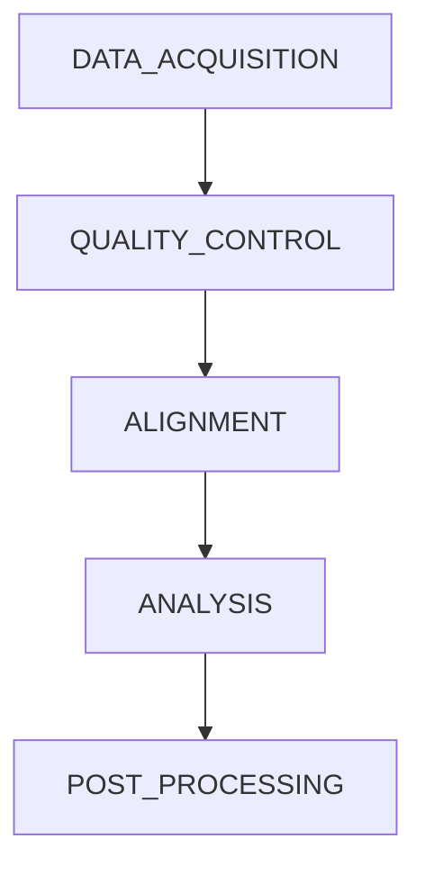

<!--
AUTO-GENERATED FILE.

Generated by docs/generate_docs.py

Do not edit manually.
-->

# Main

RIBOSEQ PIPELINE
Ribosome profiling data processing pipeline
- Data acquisition and read collapsing
- Quality control
- STAR alignment (genome + transcriptome)
- RiboMetric and RiboWaltz analysis (offsets, QC, profiles)
- BEDgraph and BigWig generation
IMPORT SUBWORKFLOWS
MAIN WORKFLOW
THE END

## Overview

This workflow invokes **5** modules.

## Modules

| Order | Module |
|------:|--------|
| 1 | `DATA_ACQUISITION` |
| 2 | `QUALITY_CONTROL` |
| 3 | `ALIGNMENT` |
| 4 | `ANALYSIS` |
| 5 | `POST_PROCESSING` |

## Workflow Diagram

## Source

`/Users/ftricomi/Documents/ensembl-genes-nf/pipelines/riboseq/main.nf`
