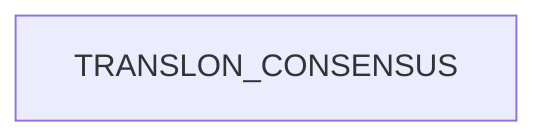

<!--
AUTO-GENERATED FILE.

Generated by docs/generate_docs.py

Do not edit manually.
-->

# Main

## Overview

This workflow invokes **1** modules.

## Modules

| Order | Module |
|------:|--------|
| 1 | `TRANSLON_CONSENSUS` |

## Workflow Diagram

## Source

`/Users/ftricomi/Documents/ensembl-genes-nf/pipelines/translon-consensus/main.nf`
