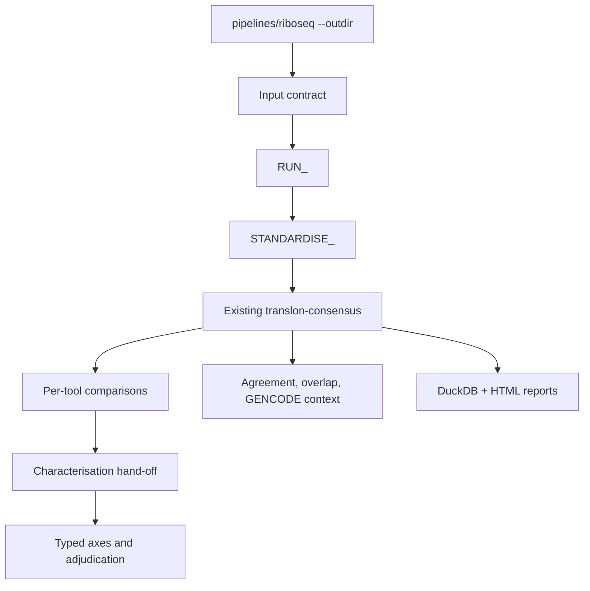

# Unified translon analysis

This is the downstream companion to `pipelines/riboseq`. It consumes the
published Ribo-seq output tree and runs each ORF caller through a deliberately
small two-stage contract: `RUN_<TOOL>` followed by `STANDARDISE_<TOOL>`. The
standardised BED12 files then feed the existing `pipelines/translon-consensus`
analysis and reporting workflow.

## Layout



## Quick start with Ribo-seq outputs

```bash
nextflow run pipelines/translon-analysis \
  --riboseq_outdir results/riboseq \
  --gtf references/annotation.gtf \
  --fasta references/genome.fa \
  --proteome_fasta references/proteome.fa \
  --tool all-wave1 \
  --min_caller_agreement 2 \
  -stub -profile local
```

The input contract discovers the conventional transcriptome and genome STAR
BAM names below `--riboseq_outdir`. Use `--transcriptome_bam_glob` or
`--genome_bam_glob` when a run uses a custom publication layout. It also
collects QC-gated offset files and published TranslonScorer CSVs for the
downstream evidence contract; use `--offsets_glob` or `--translonscorer_glob`
to override their discovery patterns.

The visible caller stages are:

- `RUN_RIBOCODE` → `STANDARDISE_RIBOCODE`
- `RUN_RIBOTRICER` → `STANDARDISE_RIBOTRICER`
- `RUN_RIBOTAPER` → `STANDARDISE_RIBOTAPER`
- `RUN_ORFQUANT` → `STANDARDISE_ORFQUANT`
- `RUN_RPBP` → `STANDARDISE_RPBP`

Preparation required by an individual caller is kept inside its run process.
Each standardiser preserves native caller fields in a common TSV and emits a
BED12 file for the existing consensus pipeline.

## Contract and outputs

The pipeline writes:

- `01_consensus/candidate_translons.tsv`: one row per normalised interval,
  including callers and agreement status;
- `01_consensus/candidate_translons.bed12`: the common coordinate output;
- `01_consensus/characterisation_intervals.tsv` and
  `translation_verdicts.tsv`: the explicit hand-off to characterisation;
- downstream typed-axis and adjudication outputs from
  `pipelines/translon-characterisation`.

The existing consensus analysis remains the primary comparison layer. It
retains per-tool results, exact start/end matches, interval overlaps, GENCODE
annotation, CDS context, UCSC links, DuckDB outputs, and HTML reporting.
Transcript-space calls must be converted to genome coordinates by their
tool-specific standardiser before they enter this layer.

Use `--canonical_gtf` when ORF discovery should use a canonical/transcript-
restricted annotation while the full `--gtf` remains the annotation for
characterisation. Caller agreement is the trust criterion; scores are not
ranked across callers, and Ribotricer scores are therefore not treated as
cross-caller comparable evidence.

Wave 2 caller modules remain available in `pipelines/orf-calling`, but are not
claimed as production support until their real run wrappers and parsers replace
the existing placeholders.
