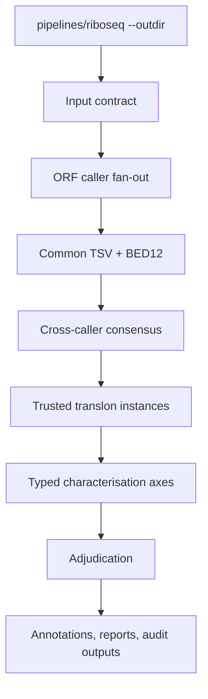

# Unified translon analysis

This is the downstream companion to `pipelines/riboseq`. It consumes the
published Ribo-seq output tree and keeps processing separate from ORF discovery,
cross-caller reconciliation and translon characterisation.

## Layout



## Quick start with Ribo-seq outputs

```bash
nextflow run pipelines/translon-analysis \
  --riboseq_outdir results/riboseq \
  --gtf references/annotation.gtf \
  --fasta references/genome.fa \
  --proteome_fasta references/proteome.fa \
  --tool all-wave1 \
  --min_caller_agreement 2 \
  -stub -profile local
```

The input contract discovers the conventional transcriptome and genome STAR
BAM names below `--riboseq_outdir`. Use `--transcriptome_bam_glob` or
`--genome_bam_glob` when a run uses a custom publication layout. It also
collects QC-gated offset files and published TranslonScorer CSVs for the
downstream evidence contract; use `--offsets_glob` or `--translonscorer_glob`
to override their discovery patterns.

## Contract and outputs

The pipeline writes:

- `01_consensus/candidate_translons.tsv`: one row per normalised interval,
  including callers and agreement status;
- `01_consensus/candidate_translons.bed12`: the common coordinate output;
- `01_consensus/characterisation_intervals.tsv` and
  `translation_verdicts.tsv`: the explicit hand-off to characterisation;
- downstream typed-axis and adjudication outputs from
  `pipelines/translon-characterisation`.

The consensus adapter is deliberately conservative. It does not turn a single
caller into a trusted translon when `--min_caller_agreement` is greater than
one. Transcript-space calls must be converted to genome coordinates before
production characterisation; the adapter does not silently perform that
conversion. For genome-space calls it translates the normalised interval from
the supplied genome FASTA to populate the characterisation hand-off; spliced
transcript-space calls still require an upstream coordinate conversion.

Wave 2 caller modules remain available in `pipelines/orf-calling`, but are not
claimed as production support until their real run wrappers and parsers replace
the existing placeholders.
