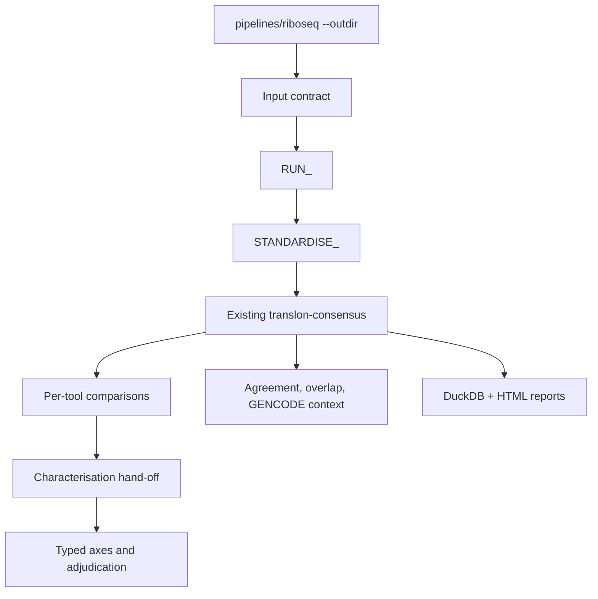

# Unified translon analysis

This is the downstream companion to `pipelines/riboseq`. It consumes the
published Ribo-seq output tree and runs each ORF caller through a deliberately
small two-stage contract: `RUN_<TOOL>` followed by `STANDARDISE_<TOOL>`. The
standardised BED12 files then feed the existing `pipelines/translon-consensus`
analysis and reporting workflow.

## Layout



## Quick start with Ribo-seq outputs

```bash
nextflow run pipelines/translon-analysis \
  --riboseq_outdir results/riboseq \
  --gtf references/annotation.gtf \
  --fasta references/genome.fa \
  --proteome_fasta references/proteome.fa \
  --tools periodicity \
  --min_caller_agreement 2 \
  -stub -profile local
```

For a cohort, first make an explicit samplesheet:

```bash
python pipelines/translon-analysis/bin/make_samplesheet.py \
  --riboseq-outdir results/riboseq \
  --output results/riboseq_samplesheet.tsv

nextflow run pipelines/translon-analysis \
  --samplesheet results/riboseq_samplesheet.tsv \
  --gtf references/annotation.gtf \
  --fasta references/genome.fa \
  --tools ribocode,price,ribotie
```

`--riboseq_outdir` remains convenient for direct upstream coupling; `--samplesheet`
is preferable for cohorts, custom filenames, or rerunning a defined sample set.
The two modes produce the same sample-keyed channels.

The input contract discovers the conventional transcriptome and genome STAR
BAM names below `--riboseq_outdir`. Use `--transcriptome_bam_glob` or
`--genome_bam_glob` when a run uses a custom publication layout. It also
collects QC-gated offset files and published TranslonScorer CSVs for the
downstream evidence contract; use `--offsets_glob` or `--translonscorer_glob`
to override their discovery patterns.

The caller input layer uses the RiboSeq outputs directly whenever the published
contract is sufficient: transcriptome BAMs go directly to RiboCode,
Ribotricer, RiboTIE and transcriptome-oriented callers; genome BAMs go directly
to iRibo, ORFquant, Ribo-TISH and PRICE. Only legacy callers receive a derived
representation. The `PREPARE_CALLER_INPUTS` subworkflow creates genePred and
BED12 transcript models from the supplied GTF and converts the transcriptome
BAM to SAM for RibORF. These conversions are per-sample, cached Nextflow tasks;
the original BAMs remain untouched.

The local Docker profile reduces the iRibo resource request to 4 GB for the
mini fixture; the SLURM/HPC configuration requests 64 GB, matching iRibo's
published memory expectation. The sparse test fixture reaches iRibo's native
candidate and profile stages but is not biologically sufficient for its final
`GenerateTranslatome.R` model, so that final native output is not marked as
validated until an adequate RiboSeq sample is used.

The visible caller stages are:

- `RUN_RIBOCODE` → `STANDARDISE_RIBOCODE`
- `RUN_RIBOTRICER` → `STANDARDISE_RIBOTRICER`
- `RUN_ORFQUANT` → `STANDARDISE_ORFQUANT`
- `RUN_RPBP` → `STANDARDISE_RPBP`
- `GEDI_INDEXGENOME` → `GEDI_PRICE` → `STANDARDISE_PRICE` (PRICE is cohort-level)

The additional published callers are `iribo`, `orfrater`,
`price`, `riborf`, `ribotish`, and `ribotie`. They can be selected with
`--tools` accepts individual callers or method groups: `periodicity`,
`frame_tests`, `learned_models`, `probabilistic`, `candidate_scoring`, and
`all`. Groups intentionally overlap because they describe analytical methods,
not implementation generations. RiboCode, Ribotricer, ORFquant, and Ribo-TISH
have pinned native runners and separate standardisers. PRICE uses the vendored
nf-core GEDI modules plus a tailored native parser and requires enough reads
for GEDI's model fit. The remaining callers still require tool-specific
containers, model assets, and input contracts.
Each caller has an explicit runner and fails if its executable, required model
or expected native output is absent. There is no generic command hook and no
synthetic output path in a real run. iRibo, ORF-RATER, RibORF and RiboTIE need
their source/model containers configured with `container_iribo`,
`container_orfrater`, `container_riborf` and `container_ribotie`. ORF-RATER
also requires `--orfrater_model`; RibORF requires a genePred annotation and
SAM converted from the transcriptome BAM because its published workflow cannot
operate from a BAM alone. Rp-Bp requires FASTQ plus rRNA and adapter resources. Those
inputs will be explicit samplesheet/configuration fields, not inferred from a
ribosome-aligned BAM.

ORF-RATER additionally stages the directory supplied with `--orfrater_model`;
it must contain `orfratings.h5`, `metagene.txt` and `offsets.txt`. The model
directory is declared as a Nextflow `path` input, so it is available inside
Docker/Apptainer tasks rather than being treated as a host-only path.

For those callers, add `ribo_fastq` for Rp-Bp to the samplesheet and provide `--ribosomal_fasta`
and `--adapter_fasta` for Rp-Bp. The optional `offsets` column carries the
QC-selected RiboSeq offsets into legacy callers that need an offset file.

Preparation required by an individual caller is kept inside its run process.
Each standardiser preserves native caller fields in a common TSV and emits a
BED12 file for the existing consensus pipeline.

RiboTaper is deliberately excluded: its published workflow requires a matched
RNA-seq BAM, while ORFquant provides the successor genome-BAM route.

## Contract and outputs

The pipeline writes:

- `01_consensus/candidate_translons.tsv`: one row per normalised interval,
  including callers and agreement status;
- `01_consensus/candidate_translons.bed12`: the common coordinate output;
- `01_consensus/characterisation_intervals.tsv` and
  `translation_verdicts.tsv`: the explicit hand-off to characterisation;
- downstream typed-axis and adjudication outputs from
  `pipelines/translon-characterisation`.

The legacy wave labels in `pipelines/orf-calling` are historical documentation
only; the unified pipeline does not expose or encode them.

The existing consensus analysis remains the primary comparison layer. It
retains per-tool results, exact start/end matches, interval overlaps, GENCODE
annotation, CDS context, UCSC links, DuckDB outputs, and HTML reporting.
Transcript-space calls must be converted to genome coordinates by their
tool-specific standardiser before they enter this layer.

Samples are processed independently. BAMs are not concatenated into one large
analysis task. Cross-sample comparison should use compact derived evidence
(normalised calls, coverage summaries, periodicity/offset metrics and scores),
not aggregated BAMs; this keeps memory and staging costs bounded while
retaining sample-level provenance.

Use `--canonical_gtf` when ORF discovery should use a canonical/transcript-
restricted annotation while the full `--gtf` remains the annotation for
characterisation. Caller agreement is the trust criterion; scores are not
ranked across callers, and Ribotricer scores are therefore not treated as
cross-caller comparable evidence.

The historical wave labels in `pipelines/orf-calling` are not used by this
workflow. The source-pinned recipes and required external assets for the
additional callers are listed in `docs/tool-module-plan.md`; a caller is only
production-supported after the real-container mini-fixture test in that matrix
has passed.

For SLURM plus Apptainer/Singularity execution, see
[`docs/hpc-setup.md`](docs/hpc-setup.md) and the companion
[`conf/hpc_apptainer.config`](conf/hpc_apptainer.config).
