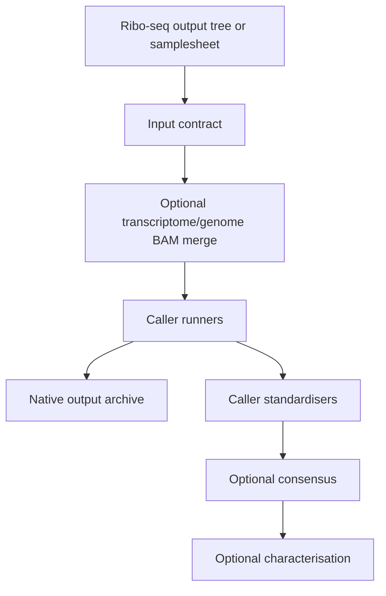

# Unified translon analysis

This pipeline consumes published `pipelines/riboseq` alignments, or an explicit
samplesheet, and runs selected ORF callers. Each caller has a native runner and
a standardiser. Native outputs are archived separately; standardised TSV and
BED12 files are used for optional consensus and characterisation.

## Workflow



## Quick start

Run directly from a Ribo-seq output directory:

```bash
nextflow run pipelines/translon-analysis \
  --riboseq_outdir results/riboseq \
  --gtf references/annotation.gtf \
  --fasta references/genome.fa \
  --tools all \
  -profile local
```

For a defined cohort, generate a samplesheet first:

```bash
python pipelines/translon-analysis/bin/make_samplesheet.py \
  --riboseq-outdir results/riboseq \
  --output results/riboseq_samplesheet.tsv

nextflow run pipelines/translon-analysis \
  --samplesheet results/riboseq_samplesheet.tsv \
  --gtf references/annotation.gtf \
  --fasta references/genome.fa \
  --tools ribocode,ribotricer,orfquant,price
```

`--samplesheet` is the better choice for cohorts, custom filenames, pooling,
and reproducible reruns. `--riboseq_outdir` discovers conventional STAR BAMs
and adjacent indexes. Override discovery with
`--transcriptome_bam_glob`, `--genome_bam_glob`, or `--offsets_glob` when
needed.

## Caller selection

`--tools` accepts individual callers, `all`, or one of these overlapping method
groups:

- `periodicity`: RiboCode, Ribotricer, Rp-Bp
- `frame_tests`: RiboCode, Ribo-TISH
- `learned_models`: ORF-RATER, RibORF, RiboTIE
- `probabilistic`: Rp-Bp, PRICE
- `candidate_scoring`: iRibo, ORFquant

The currently wired callers are RiboCode, Ribotricer, ORFquant, Rp-Bp, iRibo,
ORF-RATER, PRICE, RibORF, Ribo-TISH, and RiboTIE. RiboTaper is not part of
this workflow.

The usual alignment contracts are:

- transcriptome BAM: RiboCode and Ribotricer;
- genome BAM, falling back to transcriptome BAM: ORFquant, iRibo, Ribo-TISH,
  RiboTIE, and PRICE;
- transcriptome BAM plus derived genePred/BED12/SAM inputs: ORF-RATER and
  RibORF;
- FASTQ plus ribosomal and adapter FASTAs: Rp-Bp.

RibORF requires a samplesheet `offsets` column containing QC-selected offsets.
ORF-RATER requires `--orfrater_model`, a directory containing
`orfratings.h5`, `metagene.txt`, and `offsets.txt`. iRibo, ORF-RATER, RibORF,
and RiboTIE use configurable tool containers; the default configuration leaves
these containers unset until they are supplied by the deployment.

For a BAM-only run, set:

```bash
--skip_fastq_tools true
```

This skips Rp-Bp even if it is included by `--tools all`. It does not skip
RibORF, which uses a SAM representation derived from the transcriptome BAM and
still requires offsets.

RiboTIE currently has a high-memory CPU resource profile; no GPU requirement
is encoded in this pipeline configuration.

## Merging inputs

Add `merge_group` to the samplesheet. Rows with the same value are pooled when
`--merge_inputs true` is supplied:

```text
sample_id  merge_group  transcriptome_bam  transcriptome_bai  genome_bam  genome_bai  ribo_fastq  offsets
sample_a   pancreas     ...                 ...                ...         ...         ...         ...
sample_b   pancreas     ...                 ...                ...         ...         ...         ...
```

Transcriptome and genome BAMs are always merged independently. The merge step
stages all source BAMs and indexes, writes a source manifest, and passes the
merged alignment to downstream callers. Without `--merge_inputs true`, each
sample remains independent. The default generated `merge_group` is the sample
ID, so generated sheets do not pool samples accidentally.

## Outputs

The output directory uses semantic names:

- `native_outputs/<sample-or-group>/<RUN_PROCESS>/raw/`: the complete native
  output tree from each caller;
- `native_outputs/<sample-or-group>/<RUN_PROCESS>/versions.yml`: tool version
  information for each caller task;
- `native_outputs/price/<cohort>/`: PRICE's complete cohort-level native
  output tree;
- `merged_inputs/<merge_group>/<transcriptome-or-genome>/`: merged BAM, BAI,
  and `merge_manifest.tsv` when merging is enabled;
- `consensus_outputs/`: normalised calls, BED12 intervals, and downstream
  consensus outputs when `--run_consensus true`;
- `pipeline_info/`: the Nextflow report, timeline, trace, and DAG.

Native outputs are the archival source of truth. Standardisation preserves
common fields for comparison, but it is not intended to replace any caller's
native tables, scores, metadata, models, or auxiliary files.

Consensus compares calls and retains per-tool provenance, coordinates,
agreement status, and standardised score/p-value fields where available.
Scores are not assumed to be comparable across callers; caller agreement is
the primary cross-tool trust criterion.

Consensus and characterisation are optional. Characterisation requires both
`--run_consensus true` and `--proteome_fasta`.

## Validation and deployment

All caller processes have Nextflow stub implementations for wiring tests. Stub
runs validate input routing, optional merging, caller selection, native-output
publication, and standardisation without executing the external tools. They do
not establish biological correctness or validate real tool versions.

For HPC execution with Apptainer/Singularity, see
[`docs/hpc-setup.md`](../../docs/hpc-setup.md) and
[`conf/hpc_apptainer.config`](conf/hpc_apptainer.config).
